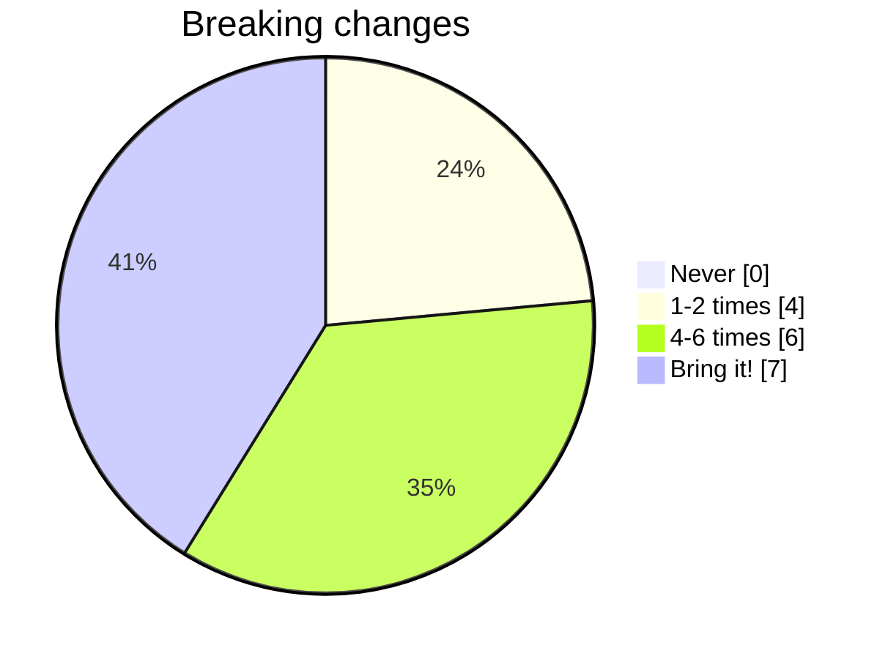
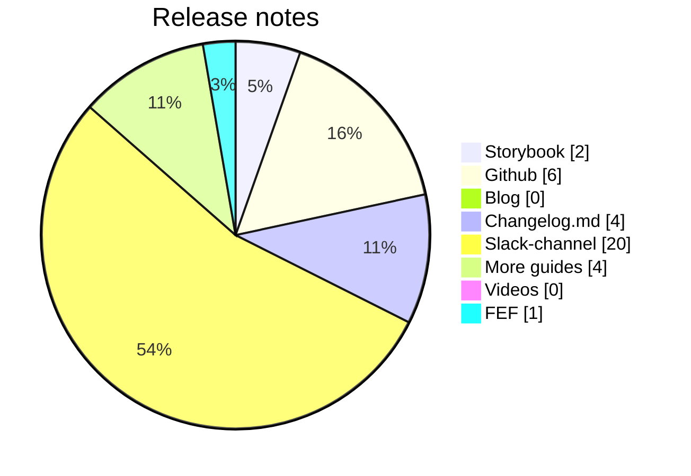

# Front-end Forum

## 22th of May

_PDF-only edition_

...
<twemoji-man-technologist/> Bobby Westberg

---
transition: slide-up
---

# <twemoji-spiral-notepad/> Agenda

* Accessibility
* Builders Core
* Poll/vote results
* Other news, updates

---
transition: slide-left
layout: center
---

# Accessibility

---
transition: slide-up
---

# <twemoji-wheelchair-symbol/> Accessibility

* Many builders-components improvements done, more to come
* Separate notes in many component docs, like `<Cards/>`
* More docs to come

---
transition: slide-left
layout: center
---

# Builders Core

<LogoGjensidige/>

---
transition: slide-left
---

# <twemoji-notebook-with-decorative-cover/> Releases

## builders-components

* 1.10 released yesterday
    * [ComboBox](https://www.gjensidige.builders/docs/core/?path=/docs/packages-builders-components-combobox--about) is no longer experimental
* 1.9 released just before 17th of May
* 1.8 released soon after last FEF
* Many handy improvements, fixes, and features!
* Many accessibility <twemoji-wheelchair-symbol/> improvements
* Take a dive in *#builders-core* for details

---
transition: slide-left
---

# <twemoji-notebook-with-decorative-cover/> builders-components 1.8

_(Not the latest version, but the latest changelog posted in #builders-core - [See Storybook for all releasenotes](https://www.gjensidige.builders/docs/core/?path=/docs/packages-builders-components-release-notes--about) were they for the time being are auto-generated.)_


---
transition: slide-left
---

# <twemoji-notebook-with-decorative-cover/> builders-components

## Important from 1.8 onwards

> **Note:** Moving forward, both **ValidationMessage** and **HelpText** should be moved outside label elements for better accessibility. This is changed in all documentation, all components will add a console.warn about the change if used incorrectly, but the update is visually backwards compatible so you can do updates gradually


```js
// Recommended way of explicitly binding labels and helptexts to an input:
const uniqueId = 'MySuperUniqueID';
<Label htmlFor={uniqueId}>Label text</Label>
<HelpText htmlFor={uniqueId}>Help text</HelpText>
<Input id={uniqueId} />

// Stop using implicit binding using wrapping, example:
<Label>
  <HelpText/>
  <Input/>
</Label>
```

---
transition: slide-left
---

# <twemoji-notebook-with-decorative-cover/> Builders Core

## Polls

We ran two polls in #frontend for two weeks. Here are the results ...

---
transition: slide-left
---

# <twemoji-notebook-with-decorative-cover/> Builders Core

## Breaking changes

Vote using emojis, stick to one vote per person, comment in the thread.

* <twemoji-unicorn/> - We expect a perfect product that never changes
* <twemoji-stop-sign/> - Break 1-2 times a year, collect as much as possible for each break (= fewer but bigger breaks)
* <twemoji-warning/> - Break 4-6 times a year, collecting a few breaking changes and grouping them together so we don't need to change the code too often or much.
* <twemoji-green-heart/> - For all I care you could break stuff in every release, I handle stuff like that for breakfast, just let me know the details (edited) 

---
transition: slide-left
---



---
transition: slide-left
---

# <twemoji-notebook-with-decorative-cover/> Builders Core

## Breaking changes

### Conclusion?

* Break more often than not (most have no problems handling breaking changes)
* Clearly communicate breaking changes
* Upgrade/migration guides and scripts
* Releasing all new "mirror"-components, like with `<ComboBox>` was liked

---
transition: slide-left
---

# <twemoji-notebook-with-decorative-cover/> Builders Core

## Release notes

* I prefer finding release notes collected for all releases in one place - for me that's Storybook (like today)
* I prefer finding release notes for all releases in one place - for me that's Github and the releases-section
* I would like to read a blog/article with release notes and some more information on gjensidige.builders
* Spawn a changelog.md (or similar) file with every package, I'll dig into it if needed
* Break down the release using beautiful emojis highlighting the updates in Slack (separate channel)
* Additional guides and more code examples on certain components, or upgrade jobs
* It would be nice with short videos on certain components, or upgrade jobs
* More information about the releases on Front-end Forum

---
transition: slide-up
---



---
transition: slide-left
---

# <twemoji-notebook-with-decorative-cover/> Builders Core

## Release notes

### Conclusion?

* Users are loving the Slack-notes
* But collect them in a separate `announcement`-channel, for easier overview
* Some people would like release notes elsewhere, like Github, Storybook or changelog.md, but not many enough, but worth keeping in mind.
* Most likely zero worries with Builders dropping the auto-generated release-notes
* Some voices on "more guides", bigger pictures, not only one component using different props

---
transition: slide-left
layout: center
---

# Gjensidige-related

<LogoGjensidige/>

---
transition: slide-up
---

# Application Portal

Using **Application Portal**? You can now activate **Faro**!

```js
  ,
  "userMonitoring": {
    "enabled": true
  }
```


<IconsWebsite/> [Release notes](https://github.com/gjensidige/application-portal/releases/tag/v20240516122201-cfff3fcb)

---
transition: slide-left
layout: center
---

# <twemoji-rolled-up-newspaper/> News, <twemoji-cherry-blossom/> Inspiration, <twemoji-package/> Updates

---
transition: slide-left
---

# <twemoji-rolled-up-newspaper/> State of HTML 2023

A new "State of"-survey targeting the ever growing area of HTML, and related topics.

* Ran Sept - Oct 2023
* Close to 21k total responses
* Less than 175 Norwegians voted
* Less than 300 Swedes voted
* Less than 350 Poles voted
* Denmark and Slovakia didn't make it to the "top 20" list of voters
    * But Czechia did ...

<IconsWebsite/> [State of HTML 2023](https://2023.stateofhtml.com/en-US)

---
transition: slide-left
---

# <twemoji-rolled-up-newspaper/> Google I/O 2024

* A lot of AI
* AI-powered DevTools for debugging
* Check article for more:

<IconsWebsite/> [10 highlights from the conference](https://developer.chrome.com/blog/web-at-io24)

---
transition: slide-left
---


# <twemoji-rolled-up-newspaper/> Safari's webkit 17.5

Webkit is the rendering-engine used only by Safari. Here's some news in the less than two week old version.

* `text-wrap: balance` now works
    * makes a chunk of text balance its lines evenly (see article for examples)
    * expensive to use, so use with care, disabled on many lines in Firefox and Chrome
* `@starting-style {}` now works
    * give an element a starting style, useful for animations and transitions
* `light-dark()` now works
    * function for easier light-dark mode

```css
:root { --background: light-dark(#000, #fff); }
body { background: var(--background); } /* Dark-mode? Variable is now #000 */
```

<IconsWebsite/> [Full release notes](https://webkit.org/blog/15383/webkit-features-in-safari-17-5/)

---
transition: slide-left
---

# <twemoji-rolled-up-newspaper/> Wake Lock API

A new API have landed in most browsers, it let's you control the screen from dimming og turning off while you run the app/website. This makes the web even more app-like.

* Landed in Chrome, Safari and Firefox
* Presentation web-apps, like Google Slides, can now stop screen from dimming
* Let web-apps that contain recepies not dim while you cook

```js
wakeLock = await navigator.wakeLock.request(); // Request a wake lock
wakeLock.release(); // Return to normal when done
```

<IconsWebsite/> [More on Wake Lock API](https://web.dev/blog/screen-wake-lock-supported-in-all-browsers)

---
transition: slide-up
layout: two-cols-header
---

# <twemoji-package/> Updates

::left::

**[React](https://react.dev)**  
18.3.1 - [out since April](https://github.com/facebook/react/releases)

**[Vite](https://vitejs.dev/)**  
5.2.11 - [see full changelog](https://github.com/vitejs/vite/releases)

**[Vitest](https://vitest.dev/)**  
1.6.0 - [also working on 2.0 beta](https://github.com/vitest-dev/vitest/releases)

**[Biome](https://biomejs.dev/)**  
1.7.3 - [1.7 released in April](https://biomejs.dev/blog/biome-v1-7/)

::right::

## Node.JS
<IconsWebsite/> https://nodejs.org/en
* 20.13.1 LTS - latest 22.2.0

## Bun
<IconsWebsite/> https://bun.sh/
* 1.1.9

---
transition: slide-up
layout: center
---

# Next FEF

## Will be held the **5th of June**

**Temporary location change**: Claims "stole" Samhandlingssonen, so I have booked two replacement rooms. Use any one of them, but perhaps the ones sitting closest to a room should go there, so we spread people:
* *Jenterommet* - Sales Private, Service Private, Service Commercial
* *Musikkrommet* - Builders & App, Sales Commercial, Claims  

Use the TV in the room to tune into the show using your Mac/PC, or call the meeting using the video room device. You'll figure it out =) I'll join one of the rooms physically.

---
transition: slide-up
layout: center
---

# The end

That's all for now!

<twemoji-red-heart class="animate-ping"/>

_Only two more FEF before the summer holidays July-Aug!_

_**5th of June** and then **19th of June**_