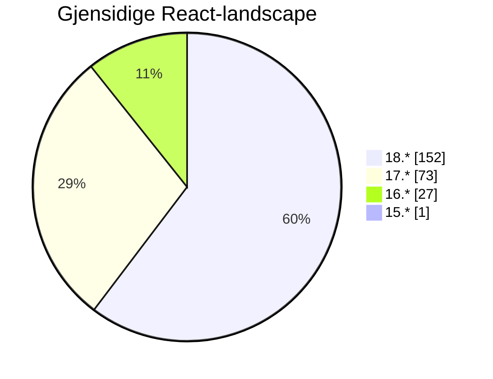
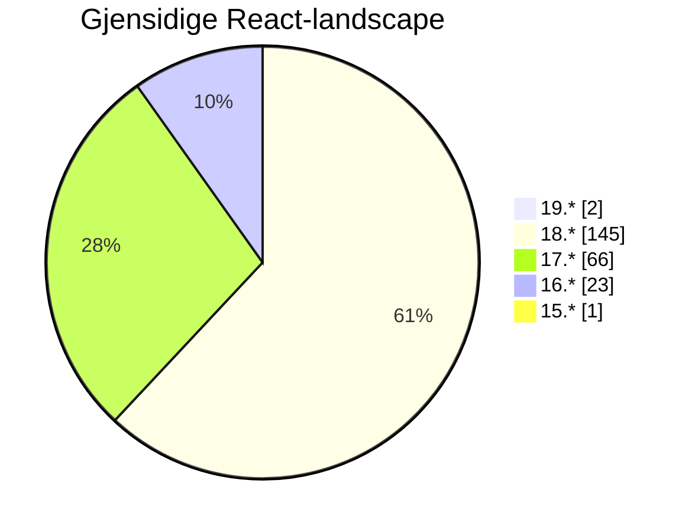
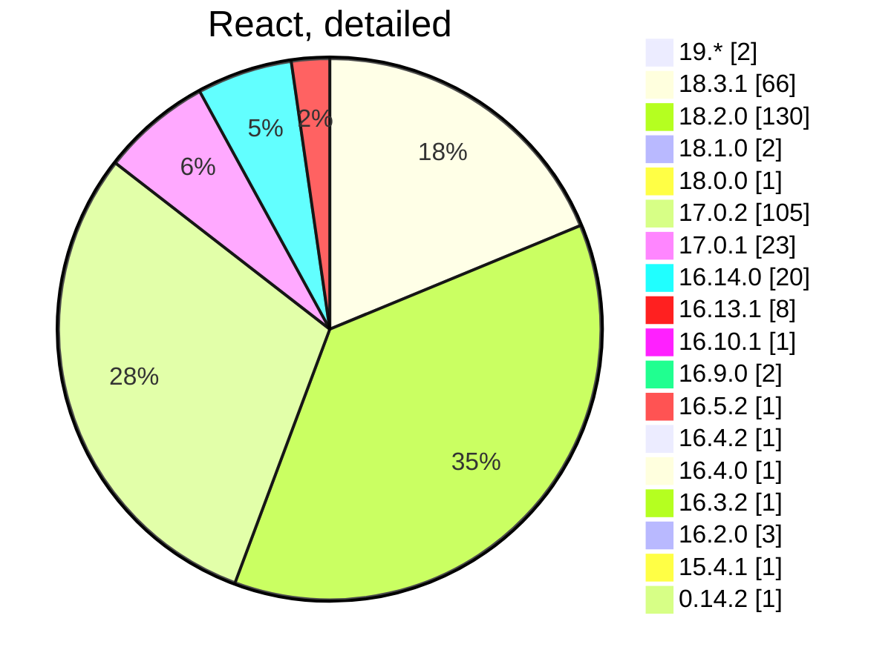

# Front-end Forum

## 9th of October

...
<twemoji-man-technologist/> Bobby Westberg

---
transition: slide-up
---

# <twemoji-spiral-notepad/> Agenda

* React stats, revisited
* Accessibility
* Builders Core
* Tech debt
* News
* Inspiration

---
transition: slide-left
layout: center
---

# Gjensidige updates

<LogoGjensidige/>

---
transition: slide-left
---

# Gjensidige

## React at Gjensidige

Remember the research in May? **Let's compare with today!**

So, using GitHub search, I get some data across our repoes.

<v-clicks>

* The search is textual, requires there is a `package.json` or more in the repo.

* Will count the rare config `"react": "17.x || 18.x",` as React 17.

* Will double-count entries stating `react` version in both `devDependencies` and `peerDependencies` 

* All searches excludes archived repoes.

* GH caches code search, making it a tiny bit unpredictable.

</v-clicks>

---
transition: slide-left
layout: two-cols
---

# Gjensidige

## Recap: React in May

* Meassured on the **6th of May**.
* We found `257` repoes
* 60% are on React 18 (double to 17)
* No one are on React 14
* Only one stuck on React 15

::right::

.  
.  

---
transition: slide-left
layout: two-cols
---

# Gjensidige

## React in October

<v-clicks>

* Meassured on the **9th of October**.
* We found `237` repoes
* We've managed to delete/archive **20 repoes** since
* Over **60%** are on **React 18** (over double to 17)
* We have stuff on **React 19**!
* **7** of React 17-apps are gone <twemoji-party-popper/>
* **4** of React 16-apps are gone <twemoji-party-popper/>

</v-clicks>

::right::

.  
.  

<v-clicks after>

</v-clicks>

---
transition: slide-left
---

Source: [Dependency insights](https://github.com/dependency-insights?query=name%3Areact+ecosystem%3Anpm+org%3Agjensidige+sort%3Apublished-asc), slightly different numbers/totals.

---
transition: slide-left
---

# Gjensidige

## Agile and Me ...

<v-clicks>

**Oh noe, not here too**

But just a short official word on what to expect, since many have asked me in person:

</v-clicks>
<v-clicks after>

> What happens to me, discipline leadership, Front-end Forum, etc?

</v-clicks>

<Spacer/>

<v-clicks after>

* My role lives on but changes title to reflect the *guild* lingo
* I will get a new manager and will be placed inside the new *enabler* *squad* **Designsystems**
* Front-end forum, and all my other forums, will remain more or less unchanged
* All **Chapter Leads** will now have community-work as part of their work description
* New guild-landscape grows and becomes more aligned
* That's all

</v-clicks>

---
transition: slide-left
layout: center
---

# <twemoji-wheelchair-symbol/> Accessibility

---
transition: slide-up
---

# <twemoji-wheelchair-symbol/> A11y docs

<v-clicks>

* Champions are now tasked at improving [our docs](https://www.gjensidige.builders/docs/core/?path=/docs/accessibility-introduction--about)
* Make sure to ask questions and throw ideas out in the open: <IconsSlack/>**#accessibility**
* One change is [the new "a11y hub" on gjensidige.builders](https://www.gjensidige.builders/learn/accessibility), our own "Learn" hub
* Methodology department will now list a11y as an official requirement
* We will create some new guides/charts for teams testing and/or prioritizing tasks

</v-clicks>
<v-clicks after>

</v-clicks>

---
transition: slide-left
layout: center
---

# Builders Core

<LogoGjensidige/>

---
transition: slide-left
---

# <twemoji-notebook-with-decorative-cover/> Builders Core

<v-clicks>

## Releases

### @gjensidige/builders-components

</v-clicks>
<v-clicks depth="2">

* **1.16.3** - last week
  * Misc improvements
  * Breaking change for those using `internal="small"` variant on `<Input>`
  * Make sure to *not* run 1.16.2

* **1.16.1** - three weeks ago
  * **Loads of improvements!**
  * Potential breaking change in `ComboBox`
  * Make sure to *not* run 1.16.0

</v-clicks>

---
transition: slide-left
---

# <twemoji-notebook-with-decorative-cover/> Builders Core

## More releases

<v-clicks>

### @gjensidige/builders-icons

* **1.6.0** - three weeks ago
* *Breaking*: changes names on multiple icons

<Spacer/>

### @gjensidige/builders-tokens@1.0.15
### @gjensidige/core-navigation@3.6.20

<Spacer/>

* <IconsSlack/>Follow **#builders-core-announcements** for release notes!
* <IconsSlack/>Use **#builders-core** for questions, bug reports, etc.

</v-clicks>

---
transition: slide-left
layout: center
---

# <twemoji-recycling-symbol/> Worth sharing

<LogoGjensidige/>

---
transition: slide-left
---

# <twemoji-recycling-symbol/> Worth sharing

<v-clicks>

##  Monorepo 2.0? Turborepo

</v-clicks>
<v-clicks after>

<IconsStar/> **Commercial DK, Pavol Repka**

</v-clicks>
<v-clicks after>

For [their commercial DK apps repo](https://github.com/gjensidige/commercial-dk-apps) they tried the old trusted "go-to" tools `lerna` and `nx` (close to same thing since nx took over lerna years ago).

This failed to deliver the speed and size they needed. It also did a lot they didn't need.

So they tried [Turborepo](https://turbo.build/repo/docs) (from Vercel) which does monorepos smarter ... and faster ... and smaller (doesn't require loads of plugins etc), and works extra smooth with Vite-apps.

It does rely on a remote cache-mechanism (cloud outside Gjensidige) but their repo shows how to do it without, so check this out in [their shared](https://github.com/gjensidige/commercial-denmark-reusable-workflows/tree/main/.github/workflows) `.github/`-workflows.

PS: This team is also doing *BiomeJS*, and are already doing *React 19* ...

PS2: [@gjensidige/service-code-quality](https://github.com/gjensidige/service/tree/main/packages/code-quality) contains a BiomeJS-config being 1:1 to service eslint config.

</v-clicks>

---
transition: slide-left
layout: center
---

# <twemoji-rolled-up-newspaper/> News, <twemoji-cherry-blossom/> Inspiration, <twemoji-package/> Updates

---
transition: slide-left
---

# <twemoji-rolled-up-newspaper/> CSS Grid Level 3 spec

Native CSS "Masonry", first public working draft by W3C.

* <IconsWebsite/> [The spec for CSS Grid Level 3](https://www.w3.org/blog/CSS/2024/09/24/css-grid-3-fpwd/)

* <IconsWebsite/> [Article diving into the topic](https://css-tricks.com/css-masonry-css-grid/)

---
transition: slide-left
---

# <twemoji-rolled-up-newspaper/> Misc news

<v-clicks>

* <IconsWebsite/> [W3C organization turned 30 years old two weeks ago](https://www.youtube.com/watch?v=0TfUBuIZkmQ)
* <IconsWebsite/> [Evan You announce Rolldown (Rollup competitor) pushing for being done](https://rolldown.rs/)
* <IconsWebsite/> [Evan You announce VoidZero Inc, will own and drive Vite, Vitest, oxc and Rolldown](https://voidzero.dev/posts/announcing-voidzero-inc)
* <IconsWebsite/> [Deno 2 Release Candidate out not long ago](https://deno.com/blog/v2.0-release-candidate)
* <IconsWebsite/> [BiomeJS turned 1 years old, release 1.9](https://biomejs.dev/blog/biome-v1-9/)
* <IconsWebsite/> [ExpressJS, version 5 just around the corner](https://expressjs.com/en/guide/migrating-5.html)
* <IconsWebsite/> [State of HTML survey, check it out](https://survey.devographics.com/en-US/survey/state-of-html/2024)
* <IconsWebsite/> [React Router announces pre-release of v7, will merge with Remix](https://reactrouter.com/dev/guides)
* <IconsWebsite/> [Legal battle between WordPress and WP Engine](https://automattic.com/2024/10/03/meritless/)
* <IconsWebsite/> [OpenAI shifts from Next.JS to Remix for their website](https://dev.to/vuelancer/openais-transition-from-nextjs-to-remix-a-deep-dive-3dpl)
* <IconsWebsite/> [CSS working group from W3C looking into a new logo](https://github.com/CSS-Next/css-next/issues/105)
* <IconsWebsite/> [Side note: work on CSS4 and CSS5 feature lists](https://github.com/CSS-Next/css-next/discussions/92)

</v-clicks>

---
transition: slide-left
---

# <twemoji-cherry-blossom/> Cleaning inspiration?

## Killing moment.js

For the last **four years**, [not even developers of moment.js want you to use moment](https://momentjs.com/docs/#/-project-status/)!

* Gjensidige [still have 54 uses](https://github.com/search?q=org%3Agjensidige+%22%5C%22moment%5C%22%3A%22+path%3Apackage.json++NOT+is%3Aarchived&type=code) of `moment.js` (and one using `moment-mini.js`).

* _Not fan of `date-fns`? Try [luxon](https://moment.github.io/luxon/#/) or [day.js](https://day.js.org/) ... or just [go vanilla](https://developer.mozilla.org/en-US/docs/Web/JavaScript/Reference/Global_Objects/Date)!_

---
transition: slide-left
---

# <twemoji-cherry-blossom/> Cleaning inspiration?

## PRs killing moment.js

### For Claims

* [I did a mini-cleanup](https://github.com/gjensidige/claims-follow/pull/937) in `claims-follow`. It used `date-fns`, `moment-mini`, and a lot of string-based functions. Replaced it all with [date-fns](https://date-fns.org/) and native Date, for sanity.

### For Sweden

* [I then tried to repeat this for Sweden](https://github.com/gjensidige/sweden-parts/pull/558) in `sweden-parts` (a mono-repo). It used `date-fns`, `moment`, and a lot of string-based functions.
  *  I replaced a lot of moment ... 
  *  ... until I found that it is required by dependencies, so had to keep it for now.
  *  Killed `date-fns` though, and a localization package for moment.

---
transition: slide-left
---

# <twemoji-cherry-blossom/> State of our package.json

<v-clicks>

## Gjensidige's package.json's are ... not too good

It looks like many repoes doesn't care for the difference between `dependencies` and `devDependencies`. Even though it is not critical, it doesn't hurt to keep it neat and tidy.

### Repeated mistakes

</v-clicks>
<v-clicks depth="2">

1. Not using `devDependencies` at all, everything goes into `deps`
    * High risk of dev-code getting into production (unless treeshaking is stellar)
2. Many repoes have same package, in both!
    * Locally, running `npm i` installs `deps` *and* `devDeps`
    * In production (`NODE_ENV=production`) all `devDeps` are ignored
3. Adding same packages to both `devDeps` and `deps`, but with different versions 
    * This will install only the highest version, but for production `devDeps` are skipped.
    * So, what is really running in production?

</v-clicks>

---
transition: slide-left
---

# devDependencies or dependencies?

## Cheat sheet

<v-clicks after>

* `eslint`, `estlint-*`, `prettier` - all **linting** things = `devDependencies`
* `typescript`, `@types/*` - all **typing** in your editor = `devDependencies`
* `vitest`, `cypress`, `playwright` - everything **testing** = `devDependencies`
* `sass`, `loader-*`, `babel`, `webpack` - everything **build**-releated = `devDependencies`
* With a few exceptions ...

</v-clicks>
<v-clicks after>

<Spacer />

### Does it matter?

</v-clicks>
<v-clicks after>

* Treeshaking does a lot, hopefully, but it cannot fix everything
* Likely to lead to confusion later, updates to the wrong package, etc
* Higher risk of inconsistencies/bugs between localhost and production
* Risky policy to rely on something wrong solving itself down the line
* Some argue it is not worth the effort

</v-clicks>

---
transition: slide-left
---

# devDependencies or dependencies?

## More

<v-clicks>

* Unsure? Check package npm-page/docs (`--save` = deps, `--save-dev` = devDeps)
* In 2024 I would suggest try to avoid `peerDependencies` for your own apps (except if you build a `module`).
* <IconsWebsite/> [Stackoverflow explains deps/devdeps very well](https://stackoverflow.com/questions/18875674/whats-the-difference-between-dependencies-devdependencies-and-peerdependencie).
* <IconsWebsite/> [dev.to](https://dev.to/writech/a-complete-guide-to-regular-dev-and-peer-dependencies-in-npm-57j9) (and [thousands more](https://dev.to/jha/save-and-save-dev-why-you-should-know-the-difference-j7p)) also writes about this.

</v-clicks>
<v-clicks after>

<Spacer/>

### Some examples:

</v-clicks>
<v-clicks after>

* **@types/node** is installed as a dep in over **40 repoes** (180 doing it right)
* **typescript** is installed as a dep in over **60 repoes**
* **eslint** is installed as a dep in over **40 repoes**
* **prettier** is installed as a dep in **10 repoes**

</v-clicks>

---
transition: slide-left
layout: two-cols
---

# <twemoji-cherry-blossom/> Tech debt

<v-clicks>

Refactoring, and working with tech debt is close to never in the backlog.

Here's an almost [ancient but very good article on an approach that actually works](https://ronjeffries.com/xprog/articles/refactoring-not-on-the-backlog/). Written by no other than Ron Jeffries (one of the founders of eXtreme Programming, and more).

> Clean up where you work, clean out the weeds implementing your feature, leave the rest (for now).

Another good article on [what it is, and why it happens](https://netgen.io/blog/how-to-cope-with-legacy-code-and-technical-debt).

</v-clicks>

::right::

<v-clicks after>

**Tech debt appears ... versus working in it**:

**A better way of approaching it**:

</v-clicks>

---
transition: slide-left
---

# <twemoji-cherry-blossom/> Reading tips

<v-clicks>

* <IconsWebsite/> [Ever in need to win an argument for your a11y-efforts?](https://www.smashingmagazine.com/2024/06/how-make-strong-case-accessibility/)
* <IconsWebsite/> [We don't have many images, but in general web, a few tips on defering their loading](https://www.debugbear.com/blog/defer-offscreen-images)
* <IconsWebsite/> [Improve performance of pages using content-visibility](https://nolanlawson.com/2024/09/18/improving-rendering-performance-with-css-content-visibility/) (more [on web.dev](https://web.dev/articles/content-visibility))
* <IconsWebsite/> [CSS so big even Wes Bos just found out about display: contents](https://www.instagram.com/p/DAbU5YoqMux/)
* <IconsWebsite/> [Guide to everything-Anchors in CSS](https://css-tricks.com/css-anchor-positioning-guide/)
* <IconsWebsite/> [Kent C. Dodds' cheat sheet for React 19](https://www.epicreact.dev/react-19-cheatsheet)
* <IconsWebsite/> [Article on refactoring, and when it can be bad](https://www.builder.io/blog/good-vs-bad-refactoring)
* <IconsWebsite/> [Why we need a different way of doing colors](https://www.smashingmagazine.com/2024/10/interview-bjorn-ottosson-creator-oklab-color-space/)

</v-clicks>

---
transition: slide-up
layout: two-cols-header
---

# <twemoji-package/> Updates

::left::

**[Vite](https://vitejs.dev/)**  
5.4.8 - [Last week](https://github.com/vitejs/vite/blob/v5.4.8/packages/vite/CHANGELOG.md) (and new website!)

**[Vitest](https://vitest.dev/)**  
2.1.2 - [2.1 is out of beta](https://github.com/vitest-dev/vitest/releases)

**[Prettier](https://prettier.io/)**  
3.3.3 - [latest stable](https://prettier.io/versions)

**[Eslint](https://eslint.org/)**  
9.11.1 - [v8 just reached EOL](https://eslint.org/version-support/)

**[TypeScript](https://www.typescriptlang.org/)**  
5.6.2 - [5.6 out a few weeks back](https://devblogs.microsoft.com/typescript/announcing-typescript-5-6/)

**[clsx](https://github.com/lukeed/clsx?tab=readme-ov-file#readme)**  
2.1.1 - Still [faster](https://github.com/lukeed/clsx/tree/master/bench) than `classnames` ([50 repoes](https://github.com/search?q=org%3Agjensidige+%22%5C%22classnames%5C%22%3A+%5C%22%5E%22+path%3Apackage.json++NOT+is%3Aarchived&type=code))

::right::

## React  
<IconsWebsite/> https://react.dev
* 18.3.1 - [v19 still in beta](https://19.react.dev/)

## Node.JS
<IconsWebsite/> https://nodejs.org/en
* 20.18.0 LTS - latest 22.9.0

## Bun
<IconsWebsite/> https://bun.sh/
* 1.1.29

---
transition: slide-up
layout: center
---

# The end

That's all for now!

<twemoji-red-heart class="animate-ping"/>

--

<twemoji-spiral-calendar/> Next FEF will be held the **23th of October**
