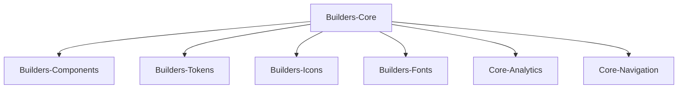

---
# try also 'default' to start simple
theme: the-unnamed

# https://sli.dev/custom/highlighters.html
#highlighter: prism
# show line numbers in code blocks
lineNumbers: true
# page transition
transition: fade-out
---

# Front-end Onboarding

## Welcome to Gjensidige!

...
<twemoji-man-technologist/> Bobby Westberg

---
transition: slide-up
---

# <twemoji-spiral-notepad/> Agenda

<v-clicks>

* First: Welcome, how are you?
* What's a "Discipline Leader Front-end"?
* Who am I?
* Our front-end community and arenas
* Our designsystem
* Slack and other useful tools for front-enders
* Accessibility, Security, GitHub, ++

</v-clicks>

---
transition: slide-left
---

# Discipline Leader Front-end

<v-clicks>

* I don't belong to any specific team
* I'm passionate about sharing, and helping
* I love collabs; cross-team, cross-discipline, cross-country
* Reusability, efficiency, smoothness, accessibility, is important for me
* My time is dedicated to our employees and our community
* Use me for getting to know the community, finding the right persons, tools, etc
* Find clever solutions, share them
* Engage in common problems, and solutions
* Help where people are stuck
* I run "Front-end Forum", "Let's talk front-end", and co-run "Accessibility forum"

</v-clicks>

---
transition: slide-up
---

# Bobby Westberg

## Front-end

<v-clicks>

* Wrote my first webpage 1996, been working professionally since 2006
* Gjensidige since 2019 (this role since 2022)
* Done a lot of everything (Java, ASP.NET, MySQL, webdesign, ++)
* Passion for front-end (vanilla, VueJS, React, Next.JS ++)
* Loves CSS, vanilla code, and CMS-integrations

</v-clicks>

<v-clicks after>

## Private

</v-clicks>

<v-clicks after>

* Swedish, 43yo, two kids (8yo & 6yo), cat (10yo)
* Norway since 2010
* Love hockey, craft beer, old games, and drawing

</v-clicks>

---
transition: slide-up
---

# Front-end at Gjensidige

* Gjensidige has many teams
* Usally cross-disciplinary and autonomous
* Organised mostly on 4th floor
* Sales, Service (logged in pages) - split on Commercial and Private
* Claims, many teams, most in Bratislava
* Builders and Mobile App
* All NO teams are coupled with DK, but also many in DK (and some in Poland)
* SE team is alone (here and in Stockholm)
* Pension sits across the street, their own AS, but share a lot
* We work often with Team Platform for getting stuff online
* We work often with Team Security for logged in things, ++

---
transition: slide-up
---

# Front-end Forum

<v-clicks depth="2">

* Talk about what affects FE-devs in Gjensidige, and general
  * New tech, new constraints, smart stuff worth sharing, new updates, ++
* For everyone (so it's in English)
* Not mandatory
* Bi-weekly on Wednesdays
* Starts 09:30, usually lasts 30-60 minutes
* On Teams and physical
  * 4th floor in "Samhandlingssonen", main office in Oslo
* Recorded, saved for 30-90 days
* Open for you to talk/share/show, and requests!
* https://www.gjensidige.builders/community/frontend-forum

</v-clicks>

---
transition: slide-up
---

# Routing

How do a webpage get to our users?

## Webseal

We have **IBM Webseal** as firewall/proxy in the very front of all we have on the web in production. This software is handled mostly by Team Security together with TietoEvry. These two also take care of **ISAM** (also from IBM) that handles identity and access.

Webseal uses something called *junctions* to direct different URLs to different internal servers.

---
transition: slide-up
---

# Routing (cont.)

## Enonic XP

Gjensidige.no-traffic will first go to our CMS, this area is refered to as "Open Pages" ("Åpne sider"). The CMS is the router here (meaning editors must create URLs). These pages are written and designed by content designers at Gjensidige, from the CMS "Enonic XP". The team responsible for developing the different parts of the pages, and maintaining the CMS, is Team Builders.

## Application Portal

At certain URLs, specified in Webseal, we will not go to the CMS but send traffic to another router, that Team Service owns. This one is known as **Application Portal**. Here each team defines a URL they want to "mount" on, and then what app to mount.

---
transition: slide-up
---

# Routing (cont.)

## Mounting apps within open pages

There's also something called *Custom Parts*, a way for editors to mount micro-apps within editorial content of open pages. This is not done a lot, but nice to be aware of the possibilities. These micro-apps are essentially React-apps, with a manifest-file listing all resources, that the CMS can load and display. These micro-apps can accept any number of key-value pair configs from the editorial interface.

## Logged in pages

This is the opposite of "open pages". These are delivered by our digital teams, they are mounted to a URL using Application Portal, and nothing comes from the CMS. Team Service (handle your insurrances) and the Claims teams, work in this domain.

---
transition: slide-left
---

# Our designsystem

Gjensidige have a state of the art design system, it is called **Builders Core**! It contains these packages:

* **Components** - ready-to-use React compound components
* **Tokens** - tokens/variables to use with less or sass for sizes, colors, spacing, etc
* **Icons** - our brand-icons
* **Fonts** - our brand-fonts
* **Analytics** - tracking-lib for all components
* **Navigation** - ready-to-use navigation components (header and footer)

---
transition: slide-up
---

# Builders Core

Builders Core is "open source", it is not available for the general public (yet ...), and it is not owned by one team in Gjensidige, it is owned by *everyone* in Gjensidige!

It is *maintained* by **Team Builders**, closely working with Gjensidige's marketing department. Still, it's a community product, you can use it and are more than welcome to fix it and extend it!

We highly appreciate - and encourage - all kinds of contributions. If unsure, feel free to discuss ideas and propositions in **#builders-core**, or with me.

The extensive documentation (wich is easily editable on Github) is open for everyone:

https://www.gjensidige.builders/docs/core/

Follow **#builders-core-announcements** for release notes!

---
transition: slide-up
---

# Gjensidige.Builders

Gjensidige employee's own website. Most of it open. Reach out if you want to contribute.

Contains best practice, guidelines, team overview (not open to the public), news, and more.

Short way to designsystem-documentation, and more.

Front-end has its own `/learn/frontend` discipline hub here. As well as `/onboarding` and `/community` are of interest.
https://www.gjensidige.builders/learn/frontend 

Read our "Principles for building web applications" (26 of them):
https://www.gjensidige.builders/community/blog/principles

https://www.gjensidige.builders/community/blog/testing-principles

https://www.gjensidige.builders/community/blog/supported-browsers

---
transition: slide-up
---

# Accessibility

This is worth a session of its own. But accessibility (often called "UU" in Norway, or a11y internationally) is of high importance in our digital products.

WCAG 2.0 is the minimum in Norway, enforced legally. But in near future WCAG 2.1 will be the standard. In 2023 we saw WCAG 2.2 being released. Gjensidige aims for 2.1, and AA, if possible AAA.

It is expected that when working for Gjensidige you can develop accordingly, and/or update yourself using available online resources, or using resources from your employer (if you're a consultant).

Slack: **#accessibility**

Read more: https://www.gjensidige.builders/docs/core/?path=/docs/accessibility-introduction--about

Mostly a short summary here:
https://www.gjensidige.builders/learn/universal-design/code

---
transition: slide-up
---

# Security

Working in fin-tech, security is of highest importance. We have our own **#security** channel in Slack, and our own **#team-security** governing this.

To assist teams, we have the handy **Security Score** website. Here you can quickly overview all repoes in Gjensidige, divided by teams and more. Each getting a score based on multiple parameters that you can easily dig into and use to strenghten your own security.

https://security-score.gjensidige.io/

---
transition: slide-up
---

# Slack for a front-ender

We use Slack as our go-to tool for internal communication. Use it rather than big meetings, or sending e-mails. Some guidance on how Gjensidige uses Slack:

* **"No" PMs** - don't let valuable information die in private messages.
* **Oppeness** - don't create private channels, unless absolutely necessary.
* **Threading** - always answer questions as a thread.

Some nice channels to watch:
* **#frontend** #design #content
* #team-builders **#builders-core** #builders-platform
* #general #random
* #gap #team-platform #team-security
* #digitalization-and-design

---
transition: slide-up
---

# GitHub

We use GitHub, but repos and secrets are not created in the web gui. Instead head to our Slack-channel **#github-at-gjensidige**

Use `/platform-github ...` to "talk" to the bot, that will open up dialogs for you to use when interacting with Github.

Ask your team for naming-conventions and overview of your repos. Some use [Conventional Commits](https://www.conventionalcommits.org/en/v1.0.0/)

#team-platform "owns" our GitHub service, they can assist with anything.

https://www.github.com/gjensidige/

Currently only closed source ='(

---
transition: slide-up
---

# Work culture

At Gjensidige we strive for and appreciate:

* Openness
* Positively challenge each other, constructive feedback
* Sharing, contributing, giving back
* Cross-disciplinary teams

Remember, we're the experts on our area, implications that design, changes, features have, is close to impossible for other disciplines to anticipate. It is our mission to educate and inform when changes can be done in a different way to ease development.

We should suggest different solutions when suitable, we should inform early when features take more time (or have bigger implications) than first known. Sometimes we should even suggest a feature not be implemented because of the technical difficulties.

We as developers are partners to the business and design, not just a one-stop-shop.

---
transition: slide-up
---

# Additional resources

## GitHub copilot
[Request "GitHub Team: Copilot Users"](https://myaccess.microsoft.com/@Gjensidige.onmicrosoft.com#/access-packages/49fd29da-f4ad-4527-8457-7d026e1dfb24)

## Our general developer checklist
https://www.gjensidige.builders/onboarding/developer-checklist

## Analytics and tracking
https://www.gjensidige.builders/core/core-analytics-package

---
transition: slide-up
---

# More help?

If there's anything else you would like help with, your teams and mentors usually do this but perhaps offload them a bit by trying me with:

* simple questions
* getting Builders Core running locally
* setting up Personal Access Token from Github
* setting up VScode and extensions
* sharing inspiration
* getting to know Builders Core better

---
transition: slide-up
layout: center
---

# That's all

...
<twemoji-red-heart class="animate-ping"/>

Welcome to Gjensidige!

Don't be afraid to reach out