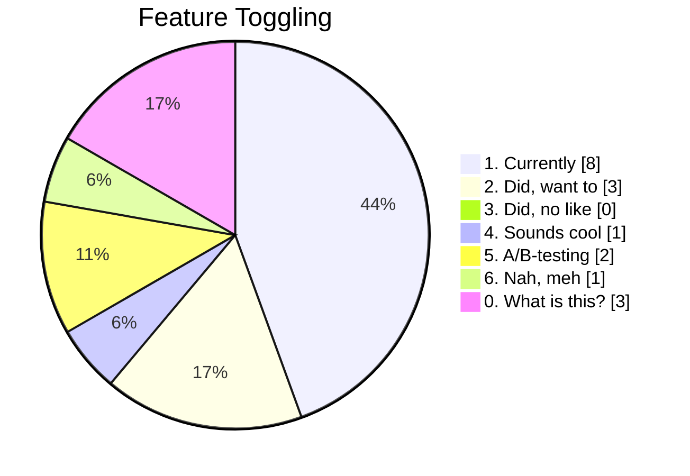

# Front-end Forum

## 28th of August

...
<twemoji-man-technologist/> Bobby Westberg

---
transition: slide-up
---

# <twemoji-spiral-notepad/> Agenda

* Accessibility
* Builders Core
* Other news, updates

---
transition: slide-left
layout: center
---

# Accessibility

---
transition: slide-up
---

# <twemoji-wheelchair-symbol/> Accessibility

<v-clicks depth="2">

* Inklud specialist have the final session with Claim teams today
  * Only two sessions with Pension remains
  * They are good, but have pointed out some false alarms + things still up for debate
* Accessibility Champion Forum to be our meeting ground now
* There's been some changes in the champion ranks
* Slovakia have trained and are now adding their own champions
* Storybook page, under principles, is on the way

</v-clicks>
<v-clicks after>

</v-clicks>

---
transition: slide-up
---

# <twemoji-palm-tree/> Summer!

## FEF takes a summer break

<v-clicks depth="2">

* Taking a break July and August
* New invites series will be set up, sent out sometimes in Aug
* Always open for feedback
  * New day of week? New time?

</v-clicks>

---
transition: slide-left
layout: center
---

# Builders Core

<LogoGjensidige/>

---
transition: slide-left
---

# <twemoji-notebook-with-decorative-cover/> Releases

## @gjensidige/builders-components

<v-clicks>

* **1.12.0** out Friday
* **1.12.1** out Monday
* And many other releases
* Many accessibility <twemoji-wheelchair-symbol/> improvements

</v-clicks>

---
transition: slide-left
---

# <twemoji-notebook-with-decorative-cover/> builders-components 1.12

---
transition: slide-left
---

# <twemoji-warning/> builders-components 1.11.2

* **Fix:** `Textarea` always track only label - not value

---
transition: slide-left
---

# <twemoji-notebook-with-decorative-cover/> Builders Core

## New Slack-channel

Follow **#builders-core-announcements** for release notes!

This is the new place to keep track on to be first on the latest fixes and features. Based on community/user feedback.

---
transition: slide-up
---

# <twemoji-spiral-notepad/> 2024 talks, to date <twemoji-red-heart class="animate-ping"/>

## So many thanks

<v-clicks>

* **Eirik Backer** and his "Builders hour"
* **Henrik Lilleengen** on "Grafana superfueled with sourcemaps"
* **Gaute Meek Olsen** and his "How I built a Kahoot-clone in VueJS"
* **Teitur Djurhuus Poulsen** & **Magnus Kjelland** on "i18next usage in Gjensidige apps"
* **Adam Hassan** and his "Automation and internal tools in Sweden"
* **Henrik Lillengen** & **Jan Ove Kjærland** talking about "React Router 6, and Remix"
* **Henrik Lilleengen** - "How I lost millions and learned that it's okay to fuck up"
* **Jonathan Linnestad** - "Application Portal, now and beyond"
* **Pavol Kogler** - "Life with bun"
* **Kristina Hovland Berg** - "What are they doing way over at pension, really?"

</v-clicks>

---
transition: slide-left
layout: center
---

# Gjensidige updates

<LogoGjensidige/>

---
transition: slide-left
---

# Smaller tracing

## Henrik Lillengen

If anyone want tracing in grafana, but dont want to pull down the huge @grafana/faro-web-tracing -lib (think it increases our bundle size with about 7% in a already huge app), i have an example implementation here where i'm doing tracing manually: https://github.com/gjensidige/salg-core/pull/365/files

---
transition: slide-left
---

# Unified Session ID

## Sigurd Falk

About session_id on our web portals :thinking_face:
Today, several apps are generating a Session ID when a user is navigating around on our web portals. Fex:
Sales online shop: https://github.com/gjensidige/salg-nettbutikk/blob/main/src/shared/utils/sessionUtils.ts
@service -libs: https://github.com/gjensidige/service/blob/main/packages/client-identification/src/index.ts#L22
Open Pages: Uses the Grafana Faro native one
This makes it hard to track user journeys across our apps and across Open- and Logged In pages.
Would it make sense to have a common way to generate session_id ? A very simple (and not at all thought through) approach could be to agree on a common place to store this ID and a common name for it everyone uses. The each app could just check if the ID exists from being generated by another app and if not generate a new one to use.
Fex:
Session ID should always be stored in the browser Session Storage with key name session_id and value format "8 digits hash"
Thought about this?

https://github.com/gjensidige/service/tree/main/packages/client-identification

---
transition: slide-left
---

:sunglasses: [Our front-end pages](https://www.gjensidige.builders/learn/frontend) have been updated!

* :compass: More relevant links and information on the [landing page](https://www.gjensidige.builders/learn/frontend), and in the main navigation.
* :books: Restructured and expanded the [Principles for building web applications](https://www.gjensidige.builders/community/blog/principles) (new order, new items - now 26 in total, improved texts)
* :student: Added some "candidate principles" to said page. These are principles we're considering. What's your input?
* :computer: Rewrote the entire [Supported browsers](https://www.gjensidige.builders/community/blog/supported-browsers) page to assist you a bit better, while also giving some sane pointers.
* :test_tube: Created a brand new page dedicated to [automated testing](https://www.gjensidige.builders/community/blog/testing-principles) at Gjensidige, since this has been asked about for a while. With this being a new page, we're eager to hear your feedback.
* :wheelchair: Updated the [universal design for developers](https://www.gjensidige.builders/learn/universal-design/code) page, refreshing some tips, and pointing readers to the brand new [accessibility guidelines in Storybook](https://www.gjensidige.builders/docs/core/?path=/docs/accessibility-introduction--about) instead.

All changes are based on discussions, questions, comments, and requests, made by *you* - the community - over time.

:palm_tree: :desert_island: Enjoy the rest of the summer! :sunny:
_(for Scandinavia it's more like :rain_cloud: :umbrella_with_rain_drops: :thunder_cloud_and_rain: :partly_sunny_rain:)_

---
transition: slide-left
---

# <twemoji-notebook-with-decorative-cover/> Builders Core

## Feature Toggling

Are you using (or used to use) feature toggling in your web applications?

* :one: I am currently using it at :gjensidige: - using external tools, our something we built ourselves
* :two: I did in previous jobs, loved it, would use again but are not using it here today
* :three: I did in previous jobs, didn't love it and won't use here
* :four: I would love to use it, but have no experience with it
* :five: Isch, a bit of A/B-testing here and there, but could probably do more if we had tools
* :six: I know what it is but see no point in using it, we ship fast :boat:
* :zero: What is feature toggling?

_Gjensidige currently have no official tooling or policy for this, but depending on needs and wants with the teams we can investigate further._

---
transition: slide-up
---

---
transition: slide-left
---

# <twemoji-notebook-with-decorative-cover/> Builders Core

## Release notes

### Conclusion?

* Users are loving the Slack-notes
* But collect them in a separate `announcement`-channel, for easier overview
* Some people would like release notes elsewhere, like Github, Storybook or changelog.md, but not many enough, but worth keeping in mind.
* Most likely zero worries with Builders dropping the auto-generated release-notes
* Some voices on "more guides", bigger pictures, not only one component using different props

---
transition: slide-left
layout: center
---

# <twemoji-rolled-up-newspaper/> News, <twemoji-cherry-blossom/> Inspiration, <twemoji-package/> Updates

---
transition: slide-left
---

# <twemoji-rolled-up-newspaper/> CSS5

## Let's talk about CSS5

CSS3 came ... in 2009! It has since grown a lot. But with this liquid version, it is hard to know if you are doing CSS3 anno 2009 or CSS3 anno 2024, which are vastly different.

Big tech-voices are starting to ask for a new CSS-version, and they want to jump directly to 5.

<IconsWebsite/> [Debate started on CSS5](https://www.smashingmagazine.com/2024/08/time-to-talk-about-css5/)

---
transition: slide-left
---

# <twemoji-rolled-up-newspaper/> jQuery 4 in beta

Some things never die. First beta was in February, second one came this summer.

> I thought jQuery was dead  
> _- The Internet_

<IconsWebsite/> [Beta 2 of jQuery 4](https://blog.jquery.com/2024/07/17/second-beta-of-jquery-4-0-0/)

---
transition: slide-left
---

# <twemoji-cherry-blossom/> Extensions

## CSS-converter

Convert between `font-size: 12px;` (CSS-style) to `fontSize: "12px"` (JS-style) with a click.

<IconsWebsite/> [CSS Converter](https://marketplace.visualstudio.com/items?itemName=Lakkannawalikar.css-converter#css-converter)

---
transition: slide-left
---

# <twemoji-cherry-blossom/> Websites

## Hate bad bug reports?

This website might assist in training POs, TLs, designers, to write better bug reports.

And it looks cool.

<IconsWebsite/> [Perfect Bug Report](https://www.perfectbugreport.io)

---
transition: slide-left
---

# <twemoji-cherry-blossom/> Link tips

## Browser baseline

* <IconsWebsite/> [CSS font-size-adjust is now in Baseline](https://web.dev/blog/font-size-adjust)
* <IconsWebsite/> [Popover API](https://developer.mozilla.org/en-US/docs/Web/API/Popover_API#browser_compatibility)
* <IconsWebsite/> [Popover API 101](https://www.amitmerchant.com/popover-api-101/)

## Other

* <IconsWebsite/> [Third-party cookies have to go](https://www.w3.org/blog/2024/third-party-cookies-have-got-to-go/)

---
transition: slide-up
layout: two-cols-header
---

# <twemoji-package/> Updates

::left::

**[React](https://react.dev)**  
18.3.1 - [out since April](https://github.com/facebook/react/releases)

**[Vite](https://vitejs.dev/)**  
5.2.12 - [see full changelog, also 6.0 alpha](https://github.com/vitejs/vite/releases)

**[Vitest](https://vitest.dev/)**  
1.6.0 - [also working on 2.0 beta](https://github.com/vitest-dev/vitest/releases)

**[Biome](https://biomejs.dev/)**  
1.8.0 - [1.8 released 20 hours ago](https://biomejs.dev/blog/biome-v1-8/)

::right::

## Node.JS
<IconsWebsite/> https://nodejs.org/en
* 20.14.0 LTS - latest 22.2.0

## Bun
<IconsWebsite/> https://bun.sh/
* 1.1.22