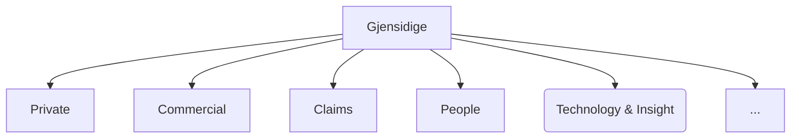
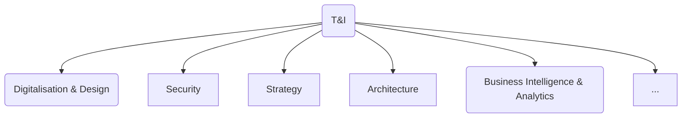
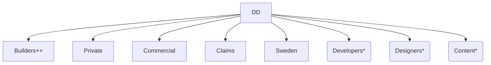
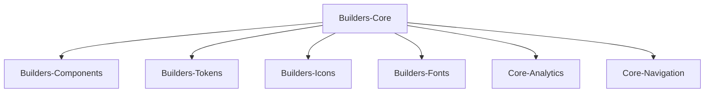

---
# try also 'default' to start simple
theme: the-unnamed

# https://sli.dev/custom/highlighters.html
#highlighter: prism
# show line numbers in code blocks
lineNumbers: true
# page transition
transition: fade-out
---

# Front-end Onboarding

## Welcome to Gjensidige!

...
<twemoji-man-technologist/> Bobby Westberg

---
transition: slide-up
---

# <twemoji-spiral-notepad/> Agenda

* What's a "Discipline Leader Front-end"?
* Who am I?
* Gjensidige, what you need to know
* Our front-end community and arenas
* Our designsystem
* Slack and other useful tools for front-enders
* Accessibility

---
transition: slide-left
---

# Discipline Leader Front-end

* I don't belong to any specific team
* I'm passionate about sharing, and helping
* I love collabs; cross-team, cross-discipline, cross-country
* Reusability, efficiency, smoothness, accessability, is important for me
* My time is dedicated to our employees and our community
* Use me for getting to know the community, finding the right persons, tools, etc

---
transition: slide-up
---

# Bobby Westberg

## Front-end
* Wrote my first webpage 1996, been working proffesionally since 2006
* Gjensidige since 2019 (this role since 2022)
* Done alot of everything (Java, ASP.NET, MySQL, webdesign, ++)
* Passion for front-end (vanilla, VueJS, React, Next.JS ++)
* Loves CSS, and the interaction that CMSes gives

## Private
* Swedish, 42yo, 2 kids (7yo & 5yo), cat (9yo)
* Norway since 2010
* Love craft beer, socks, old games, and to draw & write

---
transition: slide-left
---

# Gjensidige for a front-ender

## Gjensidige

You probably know some of our history, operating countries, markets, etc.

But where are you in this mix?

---
transition: slide-left
---

# Technology & Insights

We just say "T&I", or "T, I", in normal conversations.

The director for T&I is **Sverre Johan Rostoft**. 

Digitalisation & Design is "our" area. Our director is **Kristian Vige**.

---
transition: slide-up
---

# Digitalisation & Design

We just say "DD" (D, D) in normal conversations.

The disciplinary leaders are a shared resource for all of DD.

You are a part of a team organized in one of these delivery areas:

\* Only contains employees, not consultants, for its corresponding disciplines. Each one "lended out" to a specific delivery team. A bit like our own in-house consultant agency.

---
transition: slide-left
---

# Our designsystem

Gjensidige have a state of the art design system, it is called **Builders Core**! It contains these packages:

* **Components** - ready-to-use React compound components
* **Tokens** - tokens/variables to use with less or sass for sizes, colors, spacing, etc
* **Icons** - our brand-icons
* **Fonts** - our brand-fonts
* **Analytics** - tracking-lib for all components
* **Navigation** - ready-to-use navigation components (header and footer)

---
transition: slide-up
---

# Builders Core

Builders Core is "open source", it is not available for the general public (yet ...), and it is not owned by one team in Gjensidige, it is owned by *everyone* in Gjensidige!

It is *maintained* by **Team Builders**, closely working with Gjensidige's marketing department. Still, it's a community product, you can use it and are more than welcome to fix it and extend it!

We highly appriciate - and encourage - all kinds of contributions. If unsure, feel free to discuss ideas and propositions in #builders-core, or with me.

The extensive documentation (wich is easily editable on Github) is open for everyone:

https://www.gjensidige.builders/docs/core/

---
transition: slide-up
---

# Front-end Forum

* For everyone!
* In English
* Not mandatory
* Bi-weekly
* Physical (4th floor in "Samhandlingssonen", main office in Oslo)
* Also on Teams
* Starts 09:30, usually lasts 30-45 minutes
* Recorded, saved for 30 days
* Open for you to talk/share/show, and request!

https://www.gjensidige.builders/community/frontend-forum

---
transition: slide-up
---

# Slack for a front-ender

We use Slack as our go-to tool for internal communication. Use it rather than big meetings, or sending e-mails.

Some guidance in how Gjensidige uses Slack:
* **Openness** - don't let valuable information die in private messages.
* **Oppeness 2** - don't create private channels, unless absolutely necessary.
* **Threading** - alsways answer questions as a thread.

Some nice channels to watch:
* #general
* #gap #team-platform #team-security
* #team-builders #builders-core #builders-platform
* #frontend #design #content

---
transition: slide-up
---

# Accessibility

This is worth a session of its own. But accessability (often called "UU" in Norway) is of high importance in our digital products.

WCAG 2.0 is the minimum in Norway, enforced legally. But in near future WCAG 2.1 will be the standard.

It is expected that when working for Gjensidige you can develop accordingly, and/or update yourself using available online resources.

Read more: https://www.gjensidige.builders/learn/universal-design/universal-design-dev

---
transition: slide-up
---

# Security

Working in fin-tech, security is of highest importance. We have our own #security channel in Slack, and our own #team-security governing this.

To assist teams, Team Platform have developed the handy **Security Score** website. Here you can quickly overview all repoes in Gjensidige, divided by teams and more. Each getting a score based on multiple parameters that you can easily dig into and use to strenghten your own security.

https://security-score.gjensidige.io/

---
transition: slide-up
---

# Github

We use Github, but repos and secret are not created in the web gui. Instead head to our Slack-channel **#github-at-gjensidige**

Use `/platform-github ...` to "talk" to the bot, that will open up dialogs for you to use when interacting with Github.

Ask your team for naming-conventions and overiew of your repos. Some use [Conventional Commits](https://www.conventionalcommits.org/en/v1.0.0/)

#team-platform "owns" the Github service at us, they can assist with anything.

https://www.github.com/gjensidige/

Currently only closed source ='(

---
transition: slide-up
---

# Gjensidige.Builders

Gjensidige employee's own website. Most of it open. Reach out if you want to contribute.

Contains best practice, guidelines, team overview (not open to the public), news, and more.

Short way to Builders Core-documentation, and more.

Front-end has its own `/frontend` discipline hub here. As well as `/onboarding` and `/community` are of interest.
https://www.gjensidige.builders/frontend 

Read our "Principles for building web applications" (18 rules):
https://www.gjensidige.builders/blog/principles

---
transition: slide-up
---

# Work culture

At Gjensidige we strive for and appreciate:

* Openness
* Positively challenge each other, constructive feedback
* Sharing, contributing, giving back
* Cross-disciplinary teams

Remember, we're the experts on our area, implications that design, changes, features have, is close to impossible for other disciplines to anticipate. It is our mission to educate and inform when changes can be done in a different way to ease development.

We should suggest different solutions when suitable, we should inform early when features take more time (or have bigger implications) than first known. Sometimes we should even suggest a feature not be implemented because of the technical difficulties.

Remember, we as developers are partners to the business and design, not just a one-stop-shop.

---
transition: slide-up
---

# Additional resources

## Our developer checklist
https://www.gjensidige.builders/onboarding/developer-checklist

## Analytics and tracking
https://www.gjensidige.builders/core/core-analytics-package

---
transition: slide-up
---

# More help?

If there's anything else you would like help with, your teams and mentors usually do this but perhaps offload them a bit by trying me with:

* simple questions
* getting Builders Core running locally
* setting up Personal Access Token from Github
* setting up VScode and extensions
* sharing inspiration
* getting to know Builders Core better

---
transition: slide-up
layout: center
---

# That's all

...
<twemoji-red-heart class="animate-ping"/>

Welcome to the Gjensidige family!

Don't be afraid to reach out