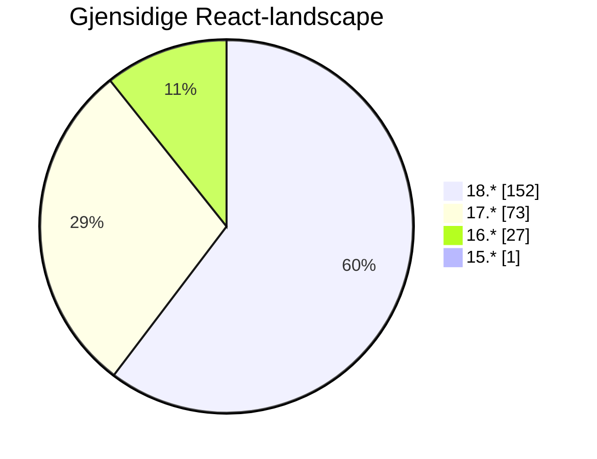
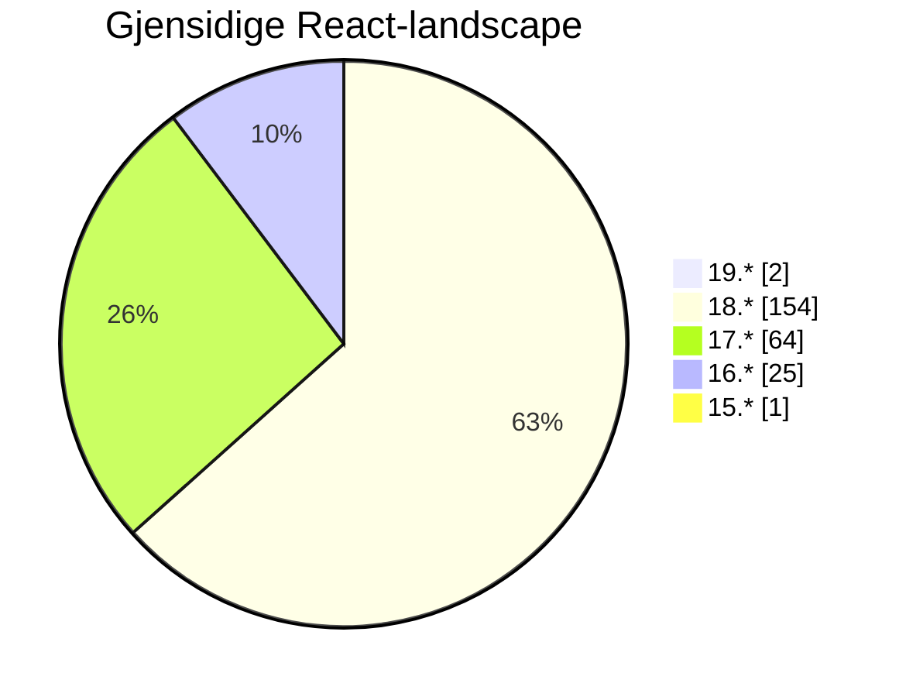
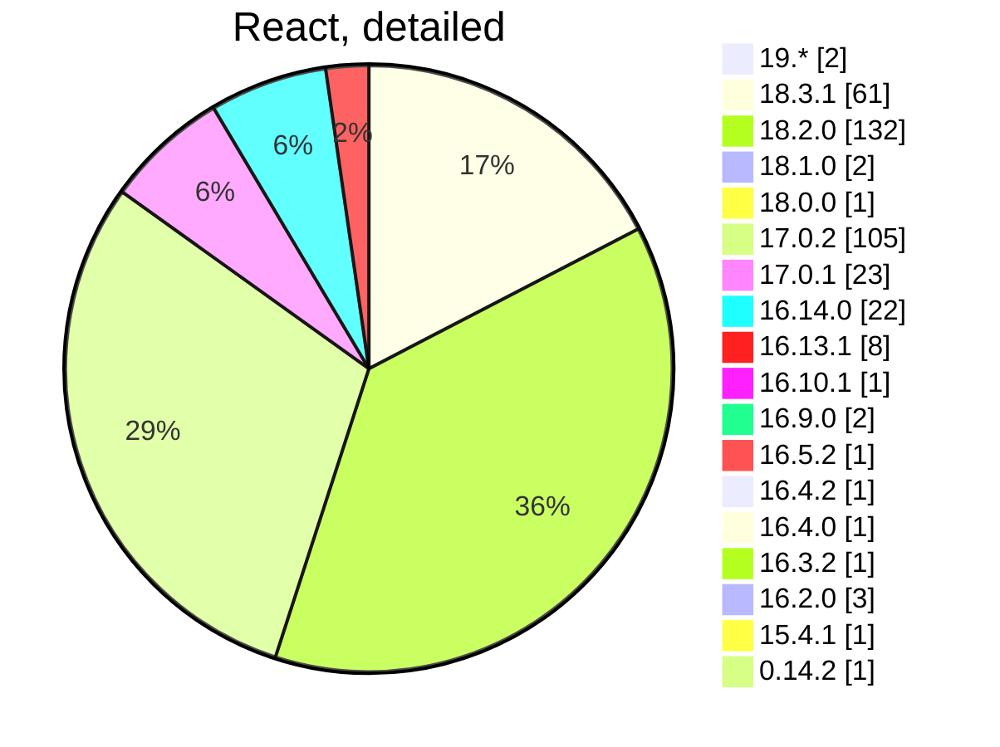

# Front-end Forum

## 9th of October

...
<twemoji-man-technologist/> Bobby Westberg

---
transition: slide-up
---

# <twemoji-spiral-notepad/> Agenda

* Accessibility
* Builders Core
* Worth sharing
* Inspiration, etc

---
transition: slide-left
---

# Gjensidige

## React at Gjensidige

Remember the research in May? **Let's compare with today!**

So, using GitHub search, I get some data across our repoes. The search is textual, requires there is a `package.json` or more in the repo.

Will count the rare config `"react": "17.x || 18.x",` as React 17.

All searches excludes archived repoes.

---
transition: slide-left
layout: two-cols
---

# Gjensidige

## React in May

* Meassured on the **6th of May**.
* We found `257` repoes
* Over 60% are on React 18.2 (double to 17)
* No one are on React 14
* Only one stuck on React 15

::right::

.  
.  

---
transition: slide-left
layout: two-cols
---

# Gjensidige

## React in October

<v-clicks>

* Meassured on the **9th of October**.
* We found `224` repoes
* We've managed to delete/archive over **30 apps** since May
* Over **60%** are on **React 18** (over double to 17)
* We have stuff on **React 19**!
* **9** of React 17-apps are gone <twemoji-party-popper/>
* **2** of React 16-apps are gone <twemoji-party-popper/>

</v-clicks>

::right::

.  
.  

<v-clicks after>

</v-clicks>

---
transition: slide-left
---

# Gjensidige

---
transition: slide-left
layout: center
---

# Accessibility

---
transition: slide-up
---

# <twemoji-wheelchair-symbol/> Accessibility

<v-clicks>

## a11y

</v-clicks>
<v-clicks after>

* Loads of PRs and issues being worked on by all teams <twemoji-flexed-biceps />

</v-clicks>
<v-clicks after>

## Docs!

</v-clicks>
<v-clicks after>

* Again, [check our a11y-doc](https://www.gjensidige.builders/docs/core/?path=/docs/accessibility-introduction--about)
* See something missing, typo, whatnot - [create a PR](https://github.com/gjensidige/builders-core/blob/next/docs/a11y/frontend.mdx) <twemoji-red-heart />

</v-clicks>
<v-clicks after>

</v-clicks>

---
transition: slide-left
layout: center
---

# Builders Core

<LogoGjensidige/>

---
transition: slide-left
---

# <twemoji-notebook-with-decorative-cover/> Builders Core

<v-clicks>

## Releases

### @gjensidige/builders-components

</v-clicks>
<v-clicks depth="2">

* **1.16.1** came three weeks ago
  * **Loads of improvements!**
  * Make sure to not run 1.16.0 though

<Spacer/>

</v-clicks>

<v-clicks after>

* <IconsSlack/>Follow **#builders-core-announcements** for release notes!
* <IconsSlack/>Use **#builders-core** for questions, bug reports, etc.

</v-clicks>

---
transition: slide-left
layout: center
---

# Gjensidige updates

<LogoGjensidige/>

---
transition: slide-left
layout: center
---

# <twemoji-recycling-symbol/> Worth sharing

<LogoGjensidige/>

---
transition: slide-left
---

# <twemoji-recycling-symbol/> Worth sharing

## XXX

<IconsStar/> XX

XXX

<IconsWebsite/> [Example PR of one of the jobs](https://github.com/gjensidige/salg-nettbutikk/pull/5754)

---
transition: slide-left
layout: center
---

# <twemoji-rolled-up-newspaper/> News, <twemoji-cherry-blossom/> Inspiration, <twemoji-package/> Updates

---
transition: slide-left
---

# <twemoji-cherry-blossom/> Cleaning inspiration?

## Killing moment.js

For the last **four years**, [not even developers of moment.js want you to use moment](https://momentjs.com/docs/#/-project-status/)!

* Gjensidige [still have 74 uses](https://github.com/search?q=org%3Agjensidige+%22%5C%22moment%5C%22%3A%22+path%3Apackage.json++NOT+is%3Aarchived&type=code) of `moment.js` (and two using `moment-mini.js`).

* _Not fan of `date-fns`? Try [luxon](https://moment.github.io/luxon/#/) or [day.js](https://day.js.org/) ... or just [go vanilla](https://developer.mozilla.org/en-US/docs/Web/JavaScript/Reference/Global_Objects/Date)!_

---
transition: slide-left
---

# <twemoji-cherry-blossom/> Cleaning inspiration?

## PRs killing moment.js

### For Claims

* [I did a mini-cleanup](https://github.com/gjensidige/claims-follow/pull/937) in `claims-follow`. It used `date-fns`, `moment-mini`, and a lot of string-based custom date functions. Replaced it all with [date-fns](https://date-fns.org/), for sanity.

### For Sweden

* [I then tried to repeat this for Sweden](https://github.com/gjensidige/sweden-parts/pull/558) in `sweden-parts` (a mono-repo). It used `date-fns`, `moment`, and a lot of string-based custom date functions. Replaced a lot of moment ... until I found that it is also passed on to shared libraries in it's entirety, so had to keep it for now.

---
transition: slide-up
layout: two-cols-header
---

# <twemoji-package/> Updates

::left::

**[React](https://react.dev)**  
18.3.1 - [out since April](https://github.com/facebook/react/releases)

**[Vite](https://vitejs.dev/)**  
5.4.3 - [Last week](https://github.com/vitejs/vite/blob/v5.4.3/packages/vite/CHANGELOG.md)

**[Vitest](https://vitest.dev/)**  
2.0.5 - [2.0 is out of beta, new beta: 2.1](https://github.com/vitest-dev/vitest/releases)

**[BiomeJS](https://biomejs.dev/)**  
1.9.0

::right::

## Node.JS
<IconsWebsite/> https://nodejs.org/en
* 20.17.0 LTS - latest 22.8.0

## Bun
<IconsWebsite/> https://bun.sh/
* 1.1.29

---
transition: slide-up
layout: center
---

# The end

That's all for now!

<twemoji-red-heart class="animate-ping"/>

--

<twemoji-spiral-calendar/> Next FEF will be held the **23th of October**
