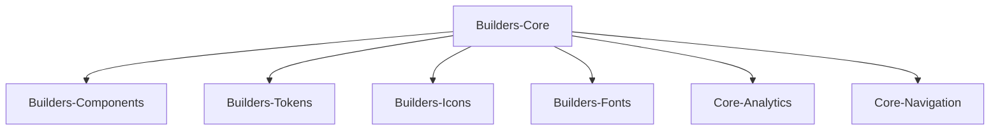

---
# try also 'default' to start simple
theme: the-unnamed

# https://sli.dev/custom/highlighters.html
#highlighter: prism
# show line numbers in code blocks
lineNumbers: true
# page transition
transition: fade-out
---

# Front-end Onboarding

## x?

...
<twemoji-man-technologist/> Bobby Westberg

---
transition: slide-up
---

# <twemoji-spiral-notepad/> Agenda

* What's a "Discipline Leader Front-end"?
* Who am I?
* Gjensidige, what you need to know
* Our front-end community and arenas
* Our designsystem
* Slack for front-enders
* Accessibility
* Security Score
* Github
* Gjensidige.builders - our community

---
transition: slide-left
---

# Discipline Leader Front-end

* hva en fagleder for front-end er
* kan hjelpe dem med
---
transition: slide-up
---

# Bobby Westberg

## Front-end
* Developed since 1996, proffesionally since 2006
* Gjensidige since 2019 (this role since 2022)
* Done alot of everything (Java, ASP.NET, MySQL, webdesign, ++)
* Passion for front-end (vanilla, VueJS, React, Next.JS ++)
* Loves CSS, and the interaction that CMSes gives

## Private
* 42yo, 2 kids, cat
* Norway since 2010
* Love socks, old games, and to draw and write

---
transition: slide-up
---

# Gjensidige for a front-ender

«Bedriften Gjensidige»
* Litt om front-end-miljøet våres (struktur)
* Litt om de ulike støtte-teamene, Builders og Platform og Security

---
transition: slide-up
---

# Front-end Forum

Arena/forum – altså Front-end Forum
* When/why/what/where/etc

---
transition: slide-left
---

# Builders Core - Our designsystem

Designsystemet
* koden bak og dokumentasjonen for det
* Ønske om at bidra tilbake (delingskultur)

---
transition: slide-up
---

# Builders Core

Our design system is called **Builders Core**!

It contains these packages:

---
transition: slide-up
---

# Slack for a front-ender

Slack-intro
* Åpen kommunikasjon på Slack (ikke bruke private meldinger)
* Populære/nyttige kanaler i Slack
* Threading i Slack

---
transition: slide-up
---

# Accessibility

Vekten av Accessibility (uten å gå i dybde)

---
transition: slide-up
---

# Security Score

Security Score – hvordan det fungerer

---
transition: slide-up
---

# Github

Github – hvordan lage repo, og annet som er spesielt hos oss

---
transition: slide-up
---

# Gjensidige.Builders

Gjensidige.Builders
* Kort om nettstedet, men spesielt /frontend/-sidene
* Gjennomgang av best practice principles vi har laget (18 punkter)

---
transition: slide-up
---

# Work culture

* Oppeness
* The power of "no"
* Sharing, contributing, giving back
* Cross-disciplinary teams

---
transition: slide-up
---

# More help?

Jeg tilbyr meg og å hjelpe dem med dette (noe de per nå ordner på egen hand, eller med en fra teamet som støtte):
* Sette opp Builders Core på egen maskin, og Github Personal Access Token
* Ta i bruk Core i praksis, bli kjent med docs

---
transition: slide-up
layout: center
---

# That's all

...
<twemoji-red-heart class="animate-ping"/>

Welcome!

Don't be afraid to reach out