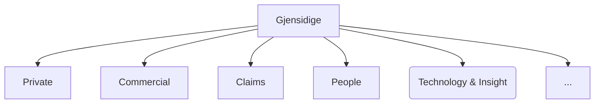
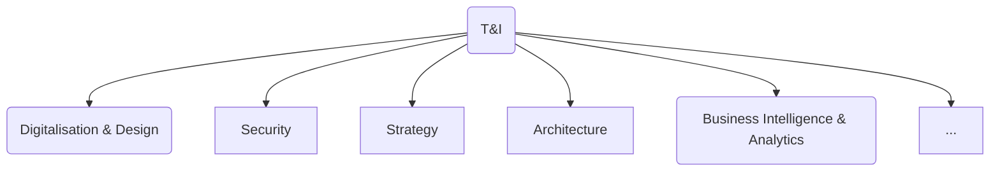
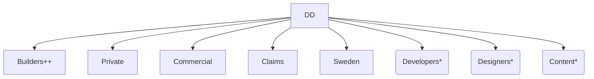
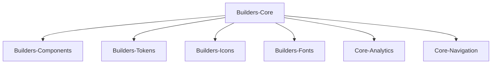

---
# try also 'default' to start simple
theme: the-unnamed

# https://sli.dev/custom/highlighters.html
#highlighter: prism
# show line numbers in code blocks
lineNumbers: true
# page transition
transition: fade-out
---

# Front-end Onboarding

## x?

...
<twemoji-man-technologist/> Bobby Westberg

---
transition: slide-up
---

# <twemoji-spiral-notepad/> Agenda

* What's a "Discipline Leader Front-end"?
* Who am I?
* Gjensidige, what you need to know
* Our front-end community and arenas
* Our designsystem
* Slack for front-enders
* Accessibility
* Security Score
* Github
* Gjensidige.builders - our community

---
transition: slide-left
---

# Discipline Leader Front-end

* hva en fagleder for front-end er
* kan hjelpe dem med

---
transition: slide-up
---

# Bobby Westberg

## Front-end
* Developed since 1996, proffesionally since 2006
* Gjensidige since 2019 (this role since 2022)
* Done alot of everything (Java, ASP.NET, MySQL, webdesign, ++)
* Passion for front-end (vanilla, VueJS, React, Next.JS ++)
* Loves CSS, and the interaction that CMSes gives

## Private
* Swedish, 42yo, 2 kids (7yo & 5yo), cat (9yo)
* Norway since 2010
* Love craft beer, socks, old games, and to draw & write

---
transition: slide-left
---

# Gjensidige for a front-ender

## Gjensidige

You probably know some of our history, operating countries, markets, etc.

But where are you in this mix?

---
transition: slide-left
---

# Technology & Insights

We just say "T&I", or "T, I", in normal conversations.

The director for T&I is **Sverre Johan Rostoft**. 

Digitalisation & Design is "our" area. Our director is **Kristian Vige**.

---
transition: slide-up
---

# Digitalisation & Design

We just say "DD" (D, D) in normal conversations.

The disciplinary leaders are a shared resource for all of DD.

You are a part of a team organized in one of these delivery areas:

\* Only contains employees, not consultants, for its corresponding disciplines. Each one "lended out" to a specific delivery team. A bit like our own in-house consultant agency.

---
transition: slide-left
---

# Our designsystem

Gjensidige have a state of the art design system, it is called **Builders Core**!

It is maintained by **Team Builders**, closely working with Gjensidige's marketing department.

It's a community effort, you can use it, but you are welcome to fix it and extend it!

It contains these packages:

---
transition: slide-up
---

# Builders Core

TODO:
* koden bak og dokumentasjonen for det
* Ønske om at bidra tilbake (delingskultur)

---
transition: slide-up
---

# Front-end Forum

* For everyone!
* In English
* Not mandatory
* Bi-weekly
* Physical (4th floor in "Samhandlingssonen", main office in Oslo)
* Also on Teams
* Starts 09:30, usually lasts 30-45 minutes
* Recorded, saved for 30 days
* Open for you to talk/share/show, and request!

https://www.gjensidige.builders/community/frontend-forum

---
transition: slide-up
---

# Slack for a front-ender

We use Slack as our go-to tool for internal communication. Use it rather than call for holding meetings, or sending e-mails.

Some guidance in how Gjensidige uses Slack:
* **Openness** - don't let valuable information die in private messages.
* **Oppeness 2** - don't create private channels, unless absolutely necessary.
* **Threading** - alsways answer questions as a thread.

Some nice channels to watch:
* #general
* #gap #team-platform #team-security
* #team-builders #builders-core #builders-platform
* #frontend #design #content

---
transition: slide-up
---

# Accessibility

TODO
Vekten av Accessibility (uten å gå i dybde)

---
transition: slide-up
---

# Security Score

TODO
Security Score – hvordan det fungerer

---
transition: slide-up
---

# Github

We use Github, but repos and secret are not created in the web gui. Instead head to our Slack-channel **#github-at-gjensidige**

Use `/platform-github ...` to "talk" to the bot, that will open up dialogs for you to use when interacting with Github.

Ask your team for naming-conventions and overiew of your repos.

#team-platform "owns" the Github service at us, they can assist with anything.

https://www.github.com/gjensidige/

Currently only closed source ='(

---
transition: slide-up
---

# Gjensidige.Builders

Gjensidige employee's own website. Most of it open. Reach out if you want to contribute.

Contains best practice, guidelines, team overview (not open to the public), news, and more.

Short way to Builders Core-documentation, and more.

Front-end has its own `/frontend` discipline hub here. As well as `/onboarding` and `/community` are of interest.
https://www.gjensidige.builders/frontend 

Read our "Principles for building web applications" (18 rules):
https://www.gjensidige.builders/blog/principles

---
transition: slide-up
---

# Work culture

TODO
* Oppeness
* The power of "no"
* Sharing, contributing, giving back
* Cross-disciplinary teams

---
transition: slide-up
---

# More help?

TODO
Jeg tilbyr meg og å hjelpe dem med dette (noe de per nå ordner på egen hand, eller med en fra teamet som støtte):
* Sette opp Builders Core på egen maskin, og Github Personal Access Token
* Ta i bruk Core i praksis, bli kjent med docs

---
transition: slide-up
layout: center
---

# That's all

...
<twemoji-red-heart class="animate-ping"/>

Welcome to the Gjensidige family!

Don't be afraid to reach out