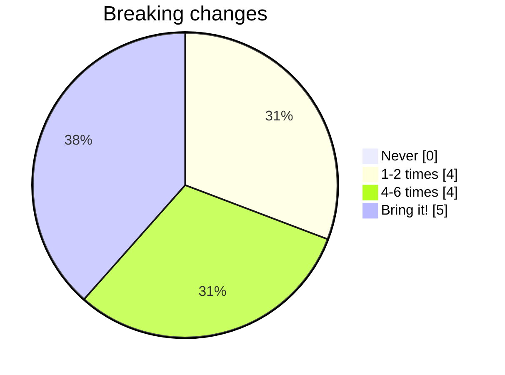
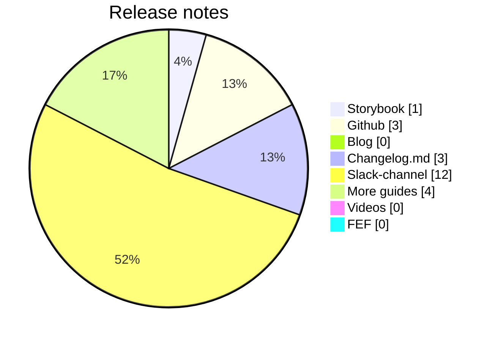

# Front-end Forum

## 22th of May

...
<twemoji-man-technologist/> Bobby Westberg

---
transition: slide-up
---

# <twemoji-spiral-notepad/> Agenda

* Accessibility
* Builders Core
* Poll/vote results
* Other news

---
transition: slide-left
layout: center
---

# Accessibility

---
transition: slide-up
---

# <twemoji-wheelchair-symbol/> Accessibility

* TODO...

---
transition: slide-left
layout: center
---

# Builders Core

---
transition: slide-left
---

# <twemoji-notebook-with-decorative-cover/> builders-components 1.8

TODO ...

Many handy improvements, fixes, and features!

Take a dive in *#builders-core* for details

---
transition: slide-left
---

# <twemoji-notebook-with-decorative-cover/> Builders Core

## Polls

We ran two polls in #frontend for two weeks. Here's the results ...

---
transition: slide-left
---

# <twemoji-notebook-with-decorative-cover/> Builders Core

## Breaking changes

Vote using emojis, stick to one vote per person, comment in the thread.

* <twemoji-unicorn/> - We expect a perfect product that never changes
* <twemoji-stop-sign/> - Break 1-2 times a year, collect as much as possible for each break (= fewer but bigger breaks)
* <twemoji-warning/> - Break 4-6 times a year, collecting a few breaking changes and grouping them together so we don't need to change the code too often or much.
* <twemoji-green-heart/> - For all I care you could break stuff in every release, I handle stuff like that for breakfast, just let me know the details (edited) 

---
transition: slide-left
---

---
transition: slide-left
---

# <twemoji-notebook-with-decorative-cover/> Builders Core

## Release notes

* I prefer finding release notes collected for all releases in one place - for me that's Storybook (like today)
* I prefer finding release notes for all releases in one place - for me that's Github and the releases-section
* I would like to read a blog/article with release notes and some more information on gjensidige.builders
* Spawn a changelog.md (or similar) file with every package, I'll dig into it if needed
* Break down the release using beautiful emojis highlighting the updates in Slack (like today, but in a separate channel)
* It would be nice with additional guides and more code examples on certain components, or upgrade jobs
* It would be nice with short videos on certain components, or upgrade jobs
* More information about the releases on Front-end Forum

---
transition: slide-up
---

---
transition: slide-left
layout: center
---

# Gjensidige-related

<LogoGjensidige/>

---
transition: slide-left
layout: center
---

# News, Inspiration, Updates

---
transition: slide-left
---

# <twemoji-rolled-up-newspaper/> News

## Xxx

---
transition: slide-up
layout: two-cols-header
---

# <twemoji-package/> Updates

::left::

**[React](https://react.dev)**  
18.3.1 - [out since April](https://github.com/facebook/react/releases)

**[Vite](https://vitejs.dev/)**  
5.2.11 - [see full changelog](https://github.com/vitejs/vite/releases)

**[Vitest](https://vitest.dev/)**  
1.6.0 - [also 2.0 beta](https://github.com/vitest-dev/vitest/releases)

**[Biome](https://biomejs.dev/)**  
1.7.3 - [1.7 released in April](https://biomejs.dev/blog/biome-v1-7/)

::right::

## Node.JS
<twemoji-globe-with-meridians/> https://nodejs.org/en
* 20.13.1 LTS - latest 22.1.0 (new!)

## Bun
<twemoji-globe-with-meridians/> https://bun.sh/
* 1.1.8

---
transition: slide-up
layout: center
---

# The end

That's all for now!

<twemoji-red-heart class="animate-ping"/>

--

<twemoji-spiral-calendar/> Next FEF will be held the **5th of June**

_Next after that will be **19th of June**, last before summer holidays July-Aug_
