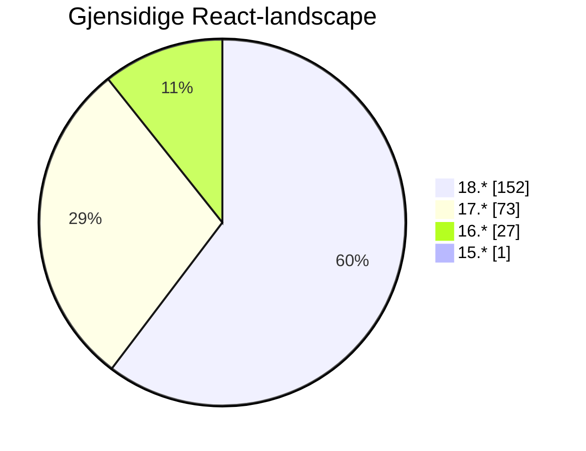
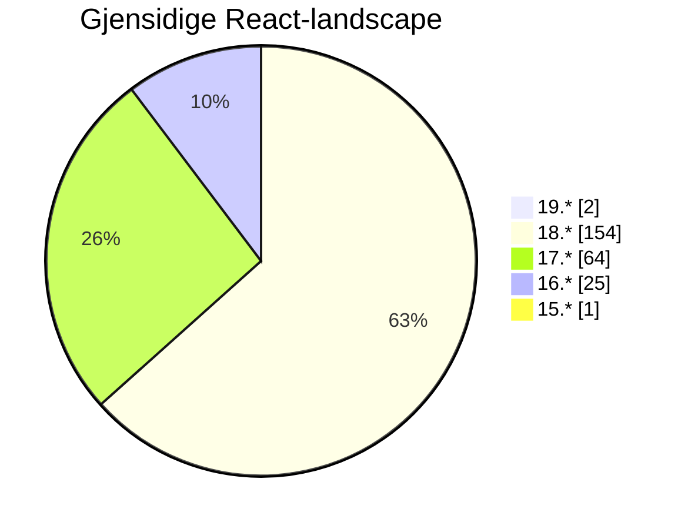
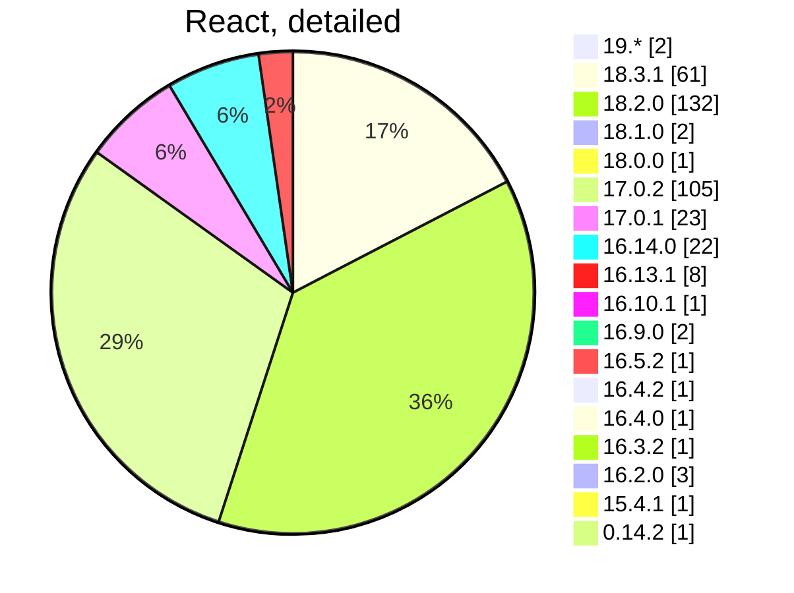

# Front-end Forum

## 9th of October

...
<twemoji-man-technologist/> Bobby Westberg

---
transition: slide-up
---

# <twemoji-spiral-notepad/> Agenda

* Accessibility
* Builders Core
* Worth sharing
* Inspiration, etc

---
transition: slide-left
layout: center
---

# Gjensidige updates

<LogoGjensidige/>

---
transition: slide-left
---

# Gjensidige

## React at Gjensidige

Remember the research in May? **Let's compare with today!**

So, using GitHub search, I get some data across our repoes. The search is textual, requires there is a `package.json` or more in the repo.

Will count the rare config `"react": "17.x || 18.x",` as React 17.

All searches excludes archived repoes.

---
transition: slide-left
layout: two-cols
---

# Gjensidige

## React in May

* Meassured on the **6th of May**.
* We found `257` repoes
* Over 60% are on React 18.2 (double to 17)
* No one are on React 14
* Only one stuck on React 15

::right::

.  
.  

---
transition: slide-left
layout: two-cols
---

# Gjensidige

## React in October

<v-clicks>

* Meassured on the **9th of October**.
* We found `224` repoes
* We've managed to delete/archive over **30 apps** since May
* Over **60%** are on **React 18** (over double to 17)
* We have stuff on **React 19**!
* **9** of React 17-apps are gone <twemoji-party-popper/>
* **2** of React 16-apps are gone <twemoji-party-popper/>

</v-clicks>

::right::

.  
.  

<v-clicks after>

</v-clicks>

---
transition: slide-left
---

---
transition: slide-left
layout: center
---

# <twemoji-wheelchair-symbol/> Accessibility

---
transition: slide-up
---

# <twemoji-wheelchair-symbol/> A11y docs

<v-clicks>

* Champions are now tasked at improving [our docs](https://www.gjensidige.builders/docs/core/?path=/docs/accessibility-introduction--about)
* Make sure to ask questions and throw ideas out in the open: <IconsSlack/>**#accessibility**
* One change is [the new "a11y hub" on gjensidige.builders](https://www.gjensidige.builders/learn/accessibility), our own "Learn" hub
* We will create some new guides for teams testing and/or prioritizing tasks

</v-clicks>
<v-clicks after>

</v-clicks>

---
transition: slide-left
layout: center
---

# Builders Core

<LogoGjensidige/>

---
transition: slide-left
---

# <twemoji-notebook-with-decorative-cover/> Builders Core

<v-clicks>

## Releases

### @gjensidige/builders-components

</v-clicks>
<v-clicks depth="2">

* **1.16.1** - three weeks ago
  * **Loads of improvements!**
  * Potential breaking change in `ComboBox`
  * Make sure to *not* run 1.16.0 though

### @gjensidige/builders-icons

* **1.6.0** - three weeks ago
* *Breaking*, changes names on multiple icons

### @gjensidige/builders-tokens@1.0.15
### @gjensidige/core-navigation@3.6.20

</v-clicks>

---
transition: slide-left
---

# <twemoji-notebook-with-decorative-cover/> Builders Core

<v-clicks>

* <IconsSlack/>Follow **#builders-core-announcements** for release notes!
* <IconsSlack/>Use **#builders-core** for questions, bug reports, etc.

</v-clicks>

---
transition: slide-left
layout: center
---

# <twemoji-recycling-symbol/> Worth sharing

<LogoGjensidige/>

---
transition: slide-left
---

# <twemoji-recycling-symbol/> Worth sharing

## XXX

<IconsStar/> XX

XXX

<IconsWebsite/> [Example PR of one of the jobs](https://github.com/gjensidige/salg-nettbutikk/pull/5754)

---
transition: slide-left
layout: center
---

# <twemoji-rolled-up-newspaper/> News, <twemoji-cherry-blossom/> Inspiration, <twemoji-package/> Updates

---
transition: slide-left
---

# <twemoji-cherry-blossom/> Cleaning inspiration?

## Killing moment.js

For the last **four years**, [not even developers of moment.js want you to use moment](https://momentjs.com/docs/#/-project-status/)!

* Gjensidige [still have 74 uses](https://github.com/search?q=org%3Agjensidige+%22%5C%22moment%5C%22%3A%22+path%3Apackage.json++NOT+is%3Aarchived&type=code) of `moment.js` (and two using `moment-mini.js`).

* _Not fan of `date-fns`? Try [luxon](https://moment.github.io/luxon/#/) or [day.js](https://day.js.org/) ... or just [go vanilla](https://developer.mozilla.org/en-US/docs/Web/JavaScript/Reference/Global_Objects/Date)!_

---
transition: slide-left
---

# <twemoji-cherry-blossom/> Cleaning inspiration?

## PRs killing moment.js

### For Claims

* [I did a mini-cleanup](https://github.com/gjensidige/claims-follow/pull/937) in `claims-follow`. It used `date-fns`, `moment-mini`, and a lot of string-based custom date functions. Replaced it all with [date-fns](https://date-fns.org/), for sanity.

### For Sweden

* [I then tried to repeat this for Sweden](https://github.com/gjensidige/sweden-parts/pull/558) in `sweden-parts` (a mono-repo). It used `date-fns`, `moment`, and a lot of string-based custom date functions.
  *  Replaced a lot of moment ... 
  *  ... until I found that it is required by dependencies, so had to keep it for now.
  *  Killed `date-fns` though, and a localization package for moment.

---
transition: slide-left
layout: two-cols
---

# <twemoji-cherry-blossom/> Tech debt

Refactoring, and working with tech debt is close to never in the backlog.

Here's an almost [ancient but very good article on an approach that actually works](https://ronjeffries.com/xprog/articles/refactoring-not-on-the-backlog/). Written by no other than Ron Jeffries, one of the founders of eXtreme Programming, and more.

> Clean up where you work, clean out the weeds implementing your feature, leave the rest (for now).

Another good article on [what it is, and why it happens](https://netgen.io/blog/how-to-cope-with-legacy-code-and-technical-debt).

::right::

**Tech debt versus working in it**:

**A better way of approaching it**:

---
transition: slide-left
---

# <twemoji-cherry-blossom/> Reading tips

* [Ever in need to win an argument for your a11y-efforts?](https://www.smashingmagazine.com/2024/06/how-make-strong-case-accessibility/)
* [We don't have many images, but in general web, a few tips on defering their loading](https://www.debugbear.com/blog/defer-offscreen-images)
* [Improve performance of pages using content-visibility](https://nolanlawson.com/2024/09/18/improving-rendering-performance-with-css-content-visibility/) (more [on web.dev](https://web.dev/articles/content-visibility))
* [Native CSS Masonry working draft by W3C](https://www.w3.org/blog/CSS/2024/09/24/css-grid-3-fpwd/)

---
transition: slide-up
layout: two-cols-header
---

# <twemoji-package/> Updates

::left::

**[React](https://react.dev)**  
18.3.1 - [out since April](https://github.com/facebook/react/releases)

**[Vite](https://vitejs.dev/)**  
5.4.3 - [Last week](https://github.com/vitejs/vite/blob/v5.4.3/packages/vite/CHANGELOG.md)

**[Vitest](https://vitest.dev/)**  
2.0.5 - [2.0 is out of beta, new beta: 2.1](https://github.com/vitest-dev/vitest/releases)

**[BiomeJS](https://biomejs.dev/)**  
1.9.0

::right::

## Node.JS
<IconsWebsite/> https://nodejs.org/en
* 20.17.0 LTS - latest 22.8.0

## Bun
<IconsWebsite/> https://bun.sh/
* 1.1.29

---
transition: slide-up
layout: center
---

# The end

That's all for now!

<twemoji-red-heart class="animate-ping"/>

--

<twemoji-spiral-calendar/> Next FEF will be held the **23th of October**
