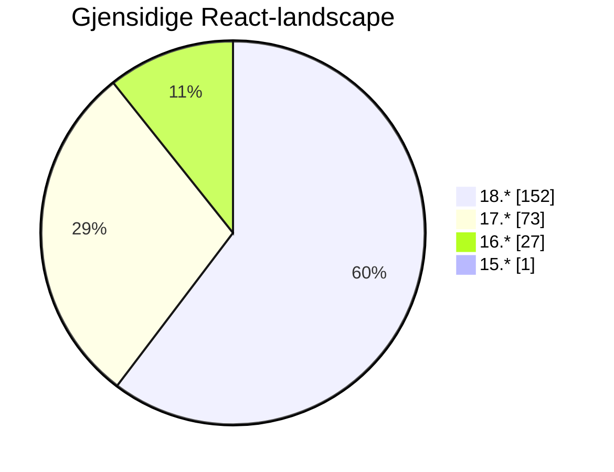

# Front-end Forum

## 8th of May

...
<twemoji-man-technologist/> Bobby Westberg

---
transition: slide-up
---

# <twemoji-spiral-notepad/> Agenda

* Accessibility
* Builders Core
* News (Node 22, React 19, ++)
* Talk: Builders sharing, release notes ++

---
transition: slide-left
layout: center
---

# Accessibility

---
transition: slide-up
---

# <twemoji-wheelchair-symbol/> Accessibility

* Keep an eye on #accessibility for tips and tricks
* Last FEF contained a list of 30+ hands-on a11y tips
* Intention is to collect things in Storybook in different forms
* I'm collecting learnings from all teams
* [Work in progress document in Confluence](https://gjensidige.atlassian.net/wiki/spaces/DIGKUN/pages/102827206/Front-end+code+tips+trix)

---
transition: slide-left
layout: center
---

# Builders Core

---
transition: slide-left
---

# <twemoji-notebook-with-decorative-cover/> builders-components 1.7

---
transition: slide-up
---

# <twemoji-notebook-with-decorative-cover/> Builders Core

**@gjensidige/builders-components@1.7.0**

Many handy improvements, fixes, and features!

Take a dive in *#builders-core* for details

---
transition: slide-left
layout: center
---

# News, Inspiration, Updates

---
transition: slide-left
layout: image-right
image: /images/2024-05-08/cdn-loading.png
---

# <twemoji-test-tube/> Gjensidige

## Faro-loading

<v-clicks>

* Occassional hickups with external CDNs
* Best pattern is to always install packages with your bundle
* Saves one request from the client - better speed
* Better security, better control

</v-clicks>

---
transition: slide-left
---

# <twemoji-rolled-up-newspaper/> News

## Node 22!

<v-clicks depth="2">

* Not LTS (until after Node 20 retires)
* **Features:**
  * V8-engine updated to 12.4
  * Require()ing ESM will just work
  * Native WebSocket client
  * Running package.json scripts with `node --run xx` (experimental)
  * And more!
* [Detailed list](https://nodejs.org/en/blog/announcements/v22-release-announce)
* [Blog about the features](https://dev.to/andreas_herz/exploring-the-exciting-new-features-in-nodejs-22-1j90)

</v-clicks>

<v-clicks after>

Don't miss: [Shape Node's next 10 years](https://linuxfoundation.surveymonkey.com/r/nodenext10survey24)

</v-clicks>

---
transition: slide-left
---

# <twemoji-rolled-up-newspaper/> News

## React 19 beta

<v-clicks depth="2">

* Beta - (*do not use these for customer/user facing apps*) - [Extensive release-notes](https://react.dev/blog/2024/04/25/react-19)
* **Many new features**:
  * [Nice article explaining it all, with examples](https://www.freecodecamp.org/news/new-react-19-features/)
  * Many features inspired by Next.JS, Astro, etc
  * React compiler! Makes your code faster build-time, for your convinience
  * New `use()` hook, makes you write less boilerplate-code with `useState` and `useEffect`
  * Easier to put more stuff on the server (form action, `use server`)
  * Improved speed, simpler APIs (bye-bye `useMemo()` etc)
  * Way easier to work with Web Components
  * Document Metadata is easier

</v-clicks>

---
transition: slide-left
layout: two-cols
---

# <twemoji-chart-increasing/> Gjensidige

## React at Gjensidige

<v-clicks>

So, what versions of React are we running? Using GitHub search, I get some data.

Stats based on `257` repoes configuring React using `package.json`, somewhere in their repos. Excluding archived repoes.

Will count `"react": "17.x || 18.x",` as 17

### Good news:

* Over 60% are on React 18.2 (double to 17)
* No one are on React 14
* Only one stuck on React 15

</v-clicks>

::right::

.  
.  

<v-clicks after>

_Meassured on the 6th of May._

</v-clicks>

---
transition: slide-up
layout: two-cols-header
---

# <twemoji-package/> Updates

::left::

#### [Biome](https://biomejs.dev/)
* 1.7.3 - [1.7 released in April](https://biomejs.dev/blog/biome-v1-7/)

#### [Vite](https://vitejs.dev/)
* 5.2.11 - [see full changelog](https://github.com/vitejs/vite/blob/v5.2.11/packages/vite/CHANGELOG.md)

#### [Vitest](https://vitest.dev/)
* 1.5.3 - [out since April](https://github.com/vitest-dev/vitest/releases/tag/v1.5.0)

::right::

## Node.JS
<twemoji-globe-with-meridians/> https://nodejs.org/en
* 20.12.2 LTS - latest 22.1.0 (new!)

## Bun
<twemoji-globe-with-meridians/> https://bun.sh/
* 1.1.7

---
transition: slide-left
layout: center
---

# Talk-time

---
transition: slide-up
---

# <twemoji-studio-microphone/> Talk

## Team Builders-"hour"

> * Release frequency and release notes strategy.
> * The way forward addressing adjustments following the accessibility review.
> * The way forward addressing needs identified during work-swap in other teams (such as "Patterns," "Flex," and "InputField")

-- Team Builders

---
transition: slide-up
layout: center
---

# The end

That's all for now!

<twemoji-red-heart class="animate-ping"/>

--

<twemoji-spiral-calendar/> Next FEF will be held the **22th of May**
